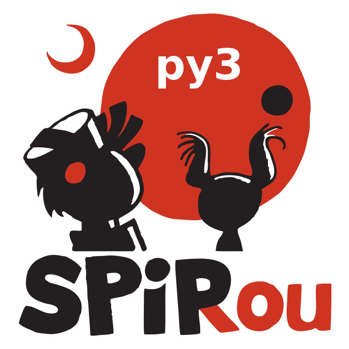

# SPIRou DRS in python 3

# Most recent released version:

-  

# Test data:

- [version 0.1.003](http://genesis.astro.umontreal.ca/neil/)

# User manual

## Download here:

# Developer manual

## Download here: 

 
 
 
 
 
 
 
 

- - - -

## Quick overview of progress (v0.1.012):

- main codes (updated to V48):

    - [x] - ~~cal_dark_spirou~~
    
    - [x] - ~~cal_loc_RAW_spioru~~
    
    - [x] - ~~cal_SLIT_spirou~~
    
    - [x] - ~~cal_FF_RAW_spirou~~
    
    - [x] - ~~cal_extract_RAW_spirou~~
    
    - [x] - ~~cal_DRIFT_RAW_spirou~~
    
    - [x] - ~~cal_BADPIX_spirou~~
    
    - [x] - ~~cal_DRIFT_E2DS_spirou~~
 
    - [x] - ~~cal_DRIFT-PEAK_E2DS_spirou~~
    
    - [ ] - cal_HC_E2DS_spirou

    - [ ] - cal_WAVE_E2DS_spirou
    
    - [x] - ~~cal_CCF_E2DS_spirou~~
    
    - [ ] - pol_spirou

- unit test run:

    - [x] - ~~cal_dark_spirou~~
    
    - [x] - ~~cal_loc_RAW_spioru~~
    
    - [x] - ~~cal_SLIT_spirou~~
    
    - [x] - ~~cal_FF_RAW_spirou~~
    
    - [x] - ~~cal_extract_RAW_spirou~~
    
    - [x] - ~~cal_DRIFT_RAW_spirou~~

    - [x] - ~~cal_BADPIX_spirou~~

    - [x] - ~~cal_DRIFT_E2DS_spirou~~

    - [x] - ~~cal_DRIFT-PEAK_E2DS_spirou~~
    
    - [ ] - cal_HC_E2DS_spirou
    
    - [ ] - cal_WAVE_E2DS_spirou
    
    - [x] - ~~cal_CCF_E2DS_spirou~~
    
    - [ ] - pol_spirou
    
- unit test outputs (Against AT-4 output)

    - [x] - ~~cal_dark_spirou~~
    
    - [x] - ~~cal_loc_RAW_spioru~~
    
    - [x] - ~~cal_SLIT_spirou~~
    
    - [x] - ~~cal_FF_RAW_spirou~~
    
    - [x] - ~~cal_extract_RAW_spirou~~
    
    - [x] - ~~cal_DRIFT_RAW_spirou~~
    
    - [x] - ~~cal_BADPIX_spirou~~
    
    - [x] - ~~cal_DRIFT_E2DS_spirou~~
    
    - [ ] - cal_HC_E2DS_spirou
 
    - [x] - ~~cal_DRIFT-PEAK_E2DS_spirou~~
      
    - [ ] - cal_WAVE_E2DS_spirou
    
    - [x] - ~~cal_CCF_E2DS_spirou~~
    
    - [ ] - pol_spirou
        
- Documentation

    - [ ] - user guide
    
    - [ ] - developer guide
    
- Help files

    - [ ] - cal_dark_spirou
    
    - [ ] - cal_loc_RAW_spioru
    
    - [ ] - cal_SLIT_spirou
    
    - [ ] - cal_FF_RAW_spirou
    
    - [ ] - cal_extract_RAW_spirou
    
    - [ ] - cal_DRIFT_RAW_spirou

    - [ ] - cal_BADPIX_spirou

    - [ ] - cal_DRIFT_E2DS_spirou

    - [ ] - cal_DRIFT-PEAK_E2DS_spirou
 
    - [ ] - cal_HC_E2DS_spirou
    
    - [ ] - cal_WAVE_E2DS_spirou
    
    - [ ] - cal_CCF_E2DS_spirou
    
    - [ ] - pol_spirou

- - - -
