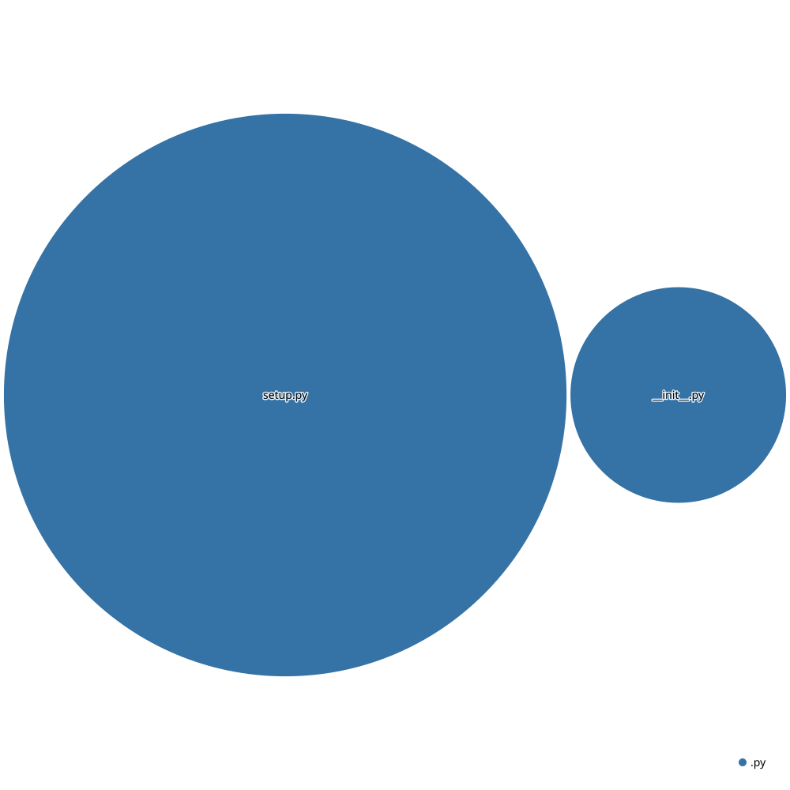

# APERO - A PipelinE to Reduce Observations

Last updated: 2026-05-06

Please see the documentation:
- [ONLINE] https://www.astro.umontreal.ca/~cook/apero-drs/index.html
- [LOCAL HTML] documentation/output/index.html
- [LOCAL PDF] documentation/output/apero-docs.pdf 


## Contents

1) [Latest version](#1-latest-version)
2) [Pre-Installation](#2-pre-installation)
3) [Installation](#3-installation)
4) [To Do and Known Issues](#4-todo-and-currently-known-issues)
5) [Using APERO](#5-using-apero)
6) [Developer mode](#6-developer-mode)

## APERO module code diagram

Using the Github Action [Repo Visualizer](https://github.com/githubocto/repo-visualizer)



##  1 Latest version
[Back to top](#apero---a-pipeline-to-reduce-observations)

- main (long term stable) V0.7.297 (2026-05-06)
    ```
    This is the version currently recommended for all general use. It may not
    contain the most up-to-date features until long term support and stability can
    be verified.
    ```
- developer (tested) V0.7.297 (2026-05-06)
    ```
    Note the developer version should have been tested and semi-stable but not
    ready for full sets of processing and defintely not for release for
    non-developers or for data put on archives. Some changes may not be
    in this version that are in the working version.
    ```
- stable-test (tested) V0.7.297 (2026-05-06)
    ```
    Notrmally up-to-date with the live version has been or is currently
    being tested for stability
    ```
- live (untested)
    ```
    Note the live version will be the most up-to-date version but has not been
    tested for stability - use at own risk.
    ```

---

## 2 Pre-Installation
[Back to top](#apero---a-pipeline-to-reduce-observations)

Please see the documentation:
- [ONLINE] https://www.astro.umontreal.ca/~cook/apero-drs/main/general/installation.html#download-from-github
- [LOCAL HTML] documentation/output/main/general/installation.html
- [LOCAL PDF] documentation/output/apero-docs.pdf 

---

## 3 Installation
[Back to top](#apero---a-pipeline-to-reduce-observations)


Please see the documentation:
- [ONLINE] https://www.astro.umontreal.ca/~cook/apero-drs/main/general/installation.html#setup
- [LOCAL HTML] documentation/output/main/general/installation.html
- [LOCAL PDF] documentation/output/apero-docs.pdf 


---


## 4 TODO and Currently known issues
[Back to top](#apero---a-pipeline-to-reduce-observations)

Please see the documentation:
- [ONLINE] https://www.astro.umontreal.ca/~cook/apero-drs/main/general/todo.html
- [LOCAL HTML] documentation/output/main/general/todo.html
- [LOCAL PDF] documentation/output/apero-docs.pdf 


---

## 5 Using APERO
[Back to top](#apero---a-pipeline-to-reduce-observations)

Please see the documentation:
- [ONLINE] https://www.astro.umontreal.ca/~cook/apero-drs/main/default/using_apero.html
- [LOCAL HTML] documentation/output/auto/tool_definitions/default/tools.html
- [LOCAL PDF] documentation/output/apero-docs.pdf 
- [APERO requirements (dev)] https://www.overleaf.com/project/681502d99cb7fde13a598227

## 6 Developer mode
[Back to top](#apero---a-pipeline-to-reduce-observations)

To install as a developer (and use tools) please follow these instructions

```bash
conda create --name apero-env-07 python=3.12
conda activate apero-env-07

git clone git@github.com:njcuk9999/apero-drs.git -b developer
git clone git@github.com:njcuk9999/lbl.git -b developer

pip install -r apero-drs/requirements_developer.txt

pip install -U -e './lbl' -e '.apero-drs/apero-ri/'
```

The follow the normal setup instructions for APERO (see documentation)

This allows you to update lbl without uninstalling and reinstalling it. 
