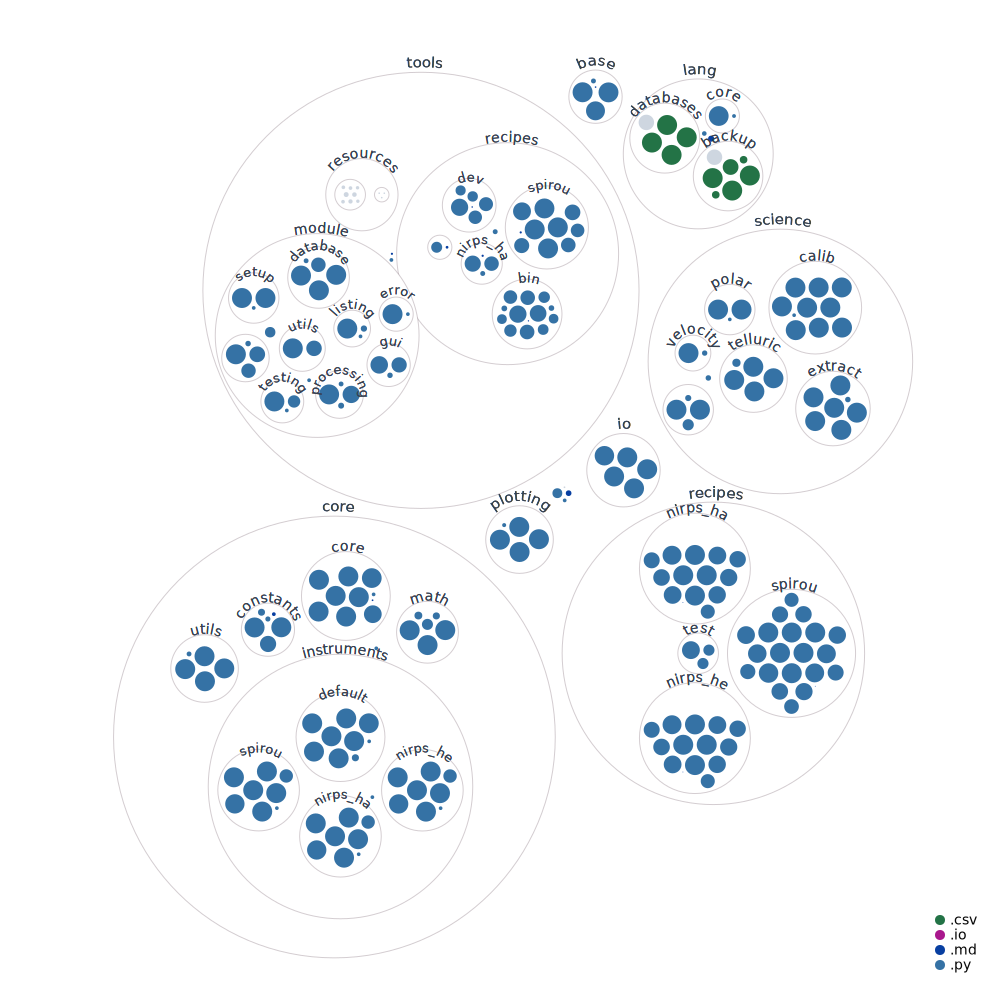

# APERO - A PipelinE to Reduce Observations

Last updated: 2022-02-11

Please see the documentation:
- [ONLINE] https://www.astro.umontreal.ca/~cook/apero-drs/index.html
- [LOCAL HTML] documentation/output/index.html
- [LOCAL PDF] documentation/output/apero-docs.pdf 


## Contents

1) [Latest version](#1-latest-version)
2) [Pre-Installation](#2-pre-installation)
3) [Installation](#3-installation)
4) [To Do and Known Issues](#4-todo-and-currently-known-issues)
5) [Using APERO](#5-using-apero)


## APERO module code diagram

Using the Github Action [Repo Visualizer](https://github.com/githubocto/repo-visualizer)



##  1 Latest version
[Back to top](#apero---a-pipeline-to-reduce-observations)

- master (long term stable) V0.6.131 (2020-09-10)
    ```
    This is the version currently recommended for all general use. It may not
    contain the most up-to-date features until long term support and stability can
    be verified.
    ```
- developer (tested) V0.7.205 (2022-02-11)
    ```
    Note the developer version should have been tested and semi-stable but not
    ready for full sets of processing and defintely not for release for
    non-developers or for data put on archives. Some changes may not be
    in this version that are in the working version.
    ```
- working (untested) V0.7.205 (2022-02-11)
    ```
    Note the working version will be the most up-to-date version but has not been
    tested for stability - use at own risk.
    ```

---

## 2 Pre-Installation
[Back to top](#apero---a-pipeline-to-reduce-observations)

Please see the documentation:
- [ONLINE] https://www.astro.umontreal.ca/~cook/apero-drs/main/general/installation.html#download-from-github
- [LOCAL HTML] documentation/output/main/general/installation.html
- [LOCAL PDF] documentation/output/apero-docs.pdf 

---

## 3 Installation
[Back to top](#apero---a-pipeline-to-reduce-observations)


Please see the documentation:
- [ONLINE] https://www.astro.umontreal.ca/~cook/apero-drs/main/general/installation.html#setup
- [LOCAL HTML] documentation/output/main/general/installation.html
- [LOCAL PDF] documentation/output/apero-docs.pdf 


---


## 4 TODO and Currently known issues
[Back to top](#apero---a-pipeline-to-reduce-observations)

Please see the documentation:
- [ONLINE] https://www.astro.umontreal.ca/~cook/apero-drs/main/general/todo.html
- [LOCAL HTML] documentation/output/main/general/todo.html
- [LOCAL PDF] documentation/output/apero-docs.pdf 


---

## 5 Using APERO
[Back to top](#apero---a-pipeline-to-reduce-observations)

Please see the documentation:
- [ONLINE] https://www.astro.umontreal.ca/~cook/apero-drs/main/default/using_apero.html
- [LOCAL HTML] documentation/output/auto/tool_definitions/default/tools.html
- [LOCAL PDF] documentation/output/apero-docs.pdf 


