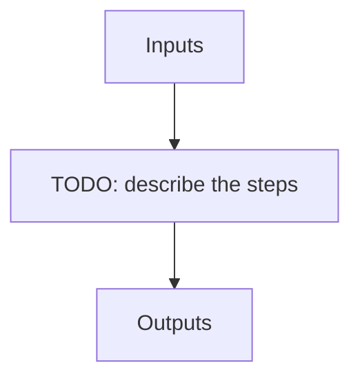

# Calibration files (NIRPS_HA)

!!! warning "Undocumented"

    No description has been written for `Calibration files` yet.

## Flow

<!-- Replace the diagram below with the real steps. -->

`HDR[XXX]` denotes a key read from the file header.

| name | description | HDR[DRSOUTID] | file type | suffix | fibers | dbname | dbkey | input file |
| --- | --- | --- | --- | --- | --- | --- | --- | --- |
| PP_REF | PP Reference flat calibration file | PP_REF | .fits | _ppref | -- | calibration | PP_REF | RAW_FLAT_FLAT |
| PP_LED_FLAT | Reference LED flat calibration file | PP_LED_FLAT | .fits | _led_flat | -- | calibration | PP_LED | RAW_LED_LED |
| DARKI | Internal dark calibration file | DARKI | .fits | _darki | -- | calibration | DARKI | DARK_DARK |
| DARKES | Eff Sky dark calibration file | DARKES | .fits | _dark_es | -- | calibration | DARK_ES | EFF_SKY_SKY |
| DARKNS | Night Sky dark calibration file | DARKNS | .fits | _dark_ns | -- | calibration | DARK_NS | NIGHT_SKY_SKY |
| DARKREF | Reference dark calibration file | DARKREF | .fits | _dark_ref | -- | calibration | DARKREF | DARK_DARK |
| BADPIX | Bad pixel map | BADPIX | .fits | _badpixel | -- | calibration | BADPIX | FLAT_FLAT |
| BKGRD_MAP | Bad pixel background map | BKGRD_MAP | .fits | _bmap.fits | -- | calibration | BKGRDMAP | FLAT_FLAT |
| LOC_LOCO | Localisation: combined order profile + position/width polynomial calibration file (all fibers) | LOC_LOCO | .fits | _loco | -- | calibration | LOC | FLAT_DARK, DARK_FLAT |
| SHAPE_X | Reference shape dx calibration file | SHAPE_X | .fits | _shapex | -- | calibration | SHAPEX | FP_FP |
| SHAPE_Y | Reference shape dy calibration file | SHAPE_Y | .fits | _shapey | -- | calibration | SHAPEY | FP_FP |
| REF_FP | Reference shape master FP calibration file | REF_FP | .fits | _fpref | -- | calibration | FPREF | FP_FP |
| SHAPEL | Nightly shape calibration files | SHAPEL | .fits | _shapel | -- | calibration | SHAPEL | FP_FP |
| FF_BLAZE | Blaze calibration file | FF_BLAZE | .fits | _blaze | A, B | calibration | BLAZE | FLAT_FLAT |
| FF_FLAT | Flat calibration file | FF_FLAT | .fits | _flat | A, B | calibration | FLAT | FLAT_FLAT |
| FLAT_RESPONSE | Per-order flat-field response profile from the convolve_irregular resampling algorithm | FLAT_RESPONSE | .fits | _flat_response | A, B | calibration | FLAT_RES | EXT_E2DS_FF, EXT_E2DS_FF, QL_E2DS_FF, QL_E2DS_FF |
| LEAKREF_E2DS | Reference leak correction calibration file | LEAKREF_E2DS | .fits | _leak_ref | A, B | calibration | LEAKREF | EXT_E2DS_FF, EXT_E2DS_FF |
| WAVESOL_REF | Reference wavelength solution calibration file | WAVESOL_REF | .fits | _wavesol_ref | A, B | calibration | WAVESOL_REF | EXT_E2DS_FF, EXT_E2DS_FF |
| WAVE_HCLIST_REF | Reference list of Hollow cathode lines calibration file | WAVE_HCLIST_REF | .fits | _waveref_hclines | A, B | calibration | WAVEHCL | EXT_E2DS_FF, EXT_E2DS_FF |
| WAVE_FPLIST_REF | -- | WAVE_FPLIST_REF | .fits | _waveref_fplines | A, B | calibration | WAVEFPL | EXT_E2DS_FF, EXT_E2DS_FF |
| WAVEREF_CAV | Reference wavelength cavity width polynomial calibration file | WAVEREF_CAV | .fits | _waveref_cav_ | A | calibration | WAVECAV | EXT_E2DS_FF, EXT_E2DS_FF |
| WAVESOL_DEFAULT | Default wavelength solution calibration file | WAVESOL_DEFAULT | .fits | _wave_d_ref | A, B | calibration | WAVESOL_DEFAULT | EXT_E2DS_FF, EXT_E2DS_FF |
| WAVEM_RES_E2DS | Reference wavelength resolution e2ds file | WAVEM_RES_E2DS | .fits | _waveref_res_e2ds | A, B | calibration | WAVR_E2DS | EXT_E2DS_FF, EXT_E2DS_FF |
| WAVE_NIGHT | Nightly wavelength solution calibration file | WAVE_NIGHT | .fits | _wave_night | A, B | calibration | WAVE | EXT_E2DS_FF, EXT_E2DS_FF |
