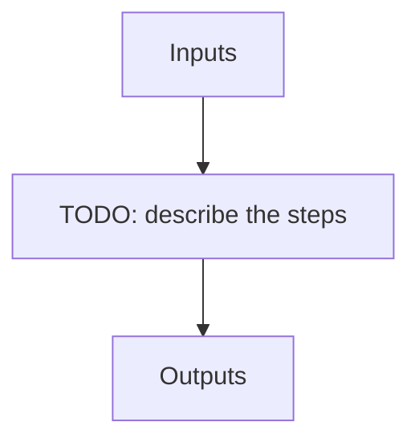

# Pre-processed files (NIRPS_HA)

!!! warning "Undocumented"

    No description has been written for `Pre-processed files` yet.

## Flow

<!-- Replace the diagram below with the real steps. -->

`HDR[XXX]` denotes a key read from the file header.

| name | description | HDR[DPRTYPE] | file type | suffix | input file |
| --- | --- | --- | --- | --- | --- |
| DARK_DARK | Preprocessed sci=DARK calib=DARK file | DARK_DARK | .fits | _pp | RAW_DARK_DARK |
| EFF_SKY_SKY | Preprocessed sci=SKY calib=SKY file | EFF_SKY_SKY | .fits | _pp | RAW_EFF_SKY_SKY |
| NIGHT_SKY_SKY | Preprocessed sci=SKY calib=SKY file | NIGHT_SKY_SKY | .fits | _pp | RAW_NIGHT_SKY_SKY |
| DAY_SKY_SKY | Preprocessed sci=SKY calib=SKY file | DAY_SKY_SKY | .fits | _pp | RAW_DAY_SKY_SKY |
| FLAT_DARK | Preprocessed sci=FLAT calib=DARK file | FLAT_DARK | .fits | _pp | RAW_FLAT_DARK |
| DARK_FLAT | Preprocessed sci=DARK calib=FLAT file | DARK_FLAT | .fits | _pp | RAW_DARK_FLAT |
| FLAT_FLAT | Preprocessed sci=FLAT calib=FLAT file | FLAT_FLAT | .fits | _pp | RAW_FLAT_FLAT |
| DARK_FP | Preprocessed sci=DARK calib=FP file | DARK_FP | .fits | _pp | RAW_DARK_FP |
| FP_DARK | Preprocessed sci=FP calib=DARK file | FP_DARK | .fits | _pp | RAW_FP_DARK |
| FP_FP | Preprocessed sci=FP calib=FP file | FP_FP | .fits | _pp | RAW_FP_FP |
| LFC_LFC | Preprocessed sci=LFC calib=LFC file | LFC_LFC | .fits | _pp | RAW_LFC_LFC |
| LFC_FP | Preprocessed sci=LFC calib=FP file | LFC_FP | .fits | _pp | RAW_LFC_FP |
| FP_LFC | Preprocessed sci=FP calib=LFC file | FP_LFC | .fits | _pp | RAW_FP_LFC |
| LFC_HCONE | Preprocessed sci=LFC calib=HC file | LFC_HCONE | .fits | _pp | RAW_LFC_HCONE |
| HCONE_LFC | Preprocessed sci=HC calib=LFC file | HCONE_LFC | .fits | _pp | RAW_HCONE_LFC |
| LED_LED | Preprocessed sci=LED calib=LED file | LED_LED | .fits | _pp | RAW_LED_LED |
| FLAT_LED | Preprocessed sci=FLAT calib=LED file | FLAT_LED | .fits | _pp | RAW_FLAT_LED |
| OBJ_DARK | Preprocessed sci=OBJ calib=DARK file | OBJ_DARK | .fits | _pp | RAW_OBJ_DARK |
| OBJ_FP | Preprocessed sci=OBJ calib=FP file | OBJ_FP | .fits | _pp | RAW_OBJ_FP |
| OBJ_HCONE | Preprocessed sci=OBJ calib=Hollow Cathode | OBJ_HCONE | .fits | _pp | RAW_OBJ_HCONE |
| OBJ_SKY | Preprocessed sci=OBJ calib=SKY | OBJ_SKY | .fits | _pp | RAW_OBJ_SKY |
| OBJ_TUN | Preprocessed sci=OBJ calib=Tungston lamp | OBJ_TUN | .fits | _pp | RAW_OBJ_TUN |
| SUN_FP | Preprocessed sci=SUN calib=FP | SUN_FP | .fits | _pp | RAW_SUN_FP |
| SUN_DARK | Preprocessed sci=SUN calib=DARK | SUN_DARK | .fits | _pp | RAW_SUN_DARK |
| FLUXSTD_SKY | Preprocessed sci=Flux standard star calib=SKY | FLUXSTD_SKY | .fits | _pp | RAW_FLUXSTD_SKY |
| TELLU_SKY | Preprocessed sci=Telluric hot star calib=SKY | TELLU_SKY | .fits | _pp | RAW_TELLU_SKY |
| DARK_HCONE | Preprocessed sci=DARK calib=Hollow Cathode file, Uranium Neon lamp | DARK_HCONE | .fits | _pp | RAW_DARK_HCONE |
| FP_HCONE | Preprocessed sci=FP calib=Hollow Cathode file, Uranium Neon lamp | FP_HCONE | .fits | _pp | RAW_FP_HCONE |
| HCONE_FP | Preprocessed sci=Hollow Cathode calib=FP file, Uranium Neion lamp | HCONE_FP | .fits | _pp | RAW_HCONE_FP |
| HCONE_HCONE | Preprocessed sci=Hollow Cathode calib=Hollow Cathode file, Uranium Neon lamp | HCONE_HCONE | .fits | _pp | RAW_HCONE_HCONE |
| HCONE_DARK | -- | HCONE_DARK | .fits | _pp | RAW_HCONE_DARK |
| DARK_HCTWO | Preprocessed sci=DARK calib=Hollow Cathode file, Uranium Neon lamp | DARK_HCOTWO | .fits | _pp | RAW_DARK_HCTWO |
| FP_HCTWO | Preprocessed sci=FP calib=Hollow Cathode file, Uranium Neon lamp | FP_HCTWO | .fits | _pp | RAW_FP_HCTWO |
| HCTWO_FP | Preprocessed sci=Hollow Cathode calib=FP file, Uranium Neion lamp | HCTWO_FP | .fits | _pp | RAW_HCTWO_FP |
| HCTWO_HCTWO | Preprocessed sci=Hollow Cathode calib=Hollow Cathode file, Uranium Neon lamp | HCTWO_HCTWO | .fits | _pp | RAW_HCTWO_HCTWO |
| HCTWO_DARK | -- | HCTWO_DARK | .fits | _pp | RAW_HCTWO_DARK |
| HCONE_HCTWO | Preprocessed sci=Hollow Cathode calib=Hollow Cathode file, Uranium Neon lamp | HCONE_HCTWO | .fits | _pp | RAW_HCONE_HCTWO |
| HCTWO_HCONE | Preprocessed sci=Hollow Cathode calib=Hollow Cathode file, Uranium Neon lamp | HCTWO_HCONE | .fits | _pp | RAW_HCTWO_HCONE |
| HCONE_LFC | Preprocessed sci=Hollow Cathode calib=LFC file, Uranium Neon lamp | HCONE_LFC | .fits | _pp | RAW_HCONE_LFC |
| HCTWO_LFC | Preprocessed sci=Hollow Cathode calib=LFC file, Uranium Neon lamp | HCTWO_LFC | .fits | _pp | RAW_HCTWO_LFC |
| CALIB_DARK_FLAT | Preprocessed sci=DARK calib=FLAT test file | CALIB_DARK_FLAT | .fits | _pp | RAW_CALIB_DARK_FLAT |
| CALIB_FLAT_DARK | Preprocessed sci=FLAT calib=DARK test file | CALIB_FLAT_DARK | .fits | _pp | RAW_CALIB_FLAT_DARK |
| TEST_DARK_FLAT | Preprocessed sci=DARK calib=FLAT test file | TEST_DARK_FLAT | .fits | _pp | RAW_TEST_DARK_FLAT |
| TEST_FLAT_DARK | Preprocessed sci=FLAT calib=DARK test file | TEST_FLAT_DARK | .fits | _pp | RAW_TEST_FLAT_DARK |
| TEST_DARK_FP | Preprocessed sci=DARK calib=FP test file | TEST_DARK_FP | .fits | _pp | RAW_TEST_DARK_FP |
| TEST_FP_FP | Preprocessed sci=FP calib=FP test file | TEST_FP_FP | .fits | _pp | RAW_TEST_FP_FP |
| TEST_LED_LED | Preprocessed sci=LED calib=LED test file | TEST_LED_LED | .fits | _pp | RAW_TEST_LED_LED |
| TEST_HCONE_HCONE | Preprocessed sci=Hollow Cathode calib=Hollow Cathode test file | TEST_HCONE_HCONE | .fits | _pp | RAW_TEST_HCONE_HCONE |
| TEST_FP_HCONE | Preprocessed sci=FP calib=Hollow Cathode test file | TEST_FP_HCONE | .fits | _pp | RAW_TEST_FP_HCONE |
| TEST_HCONE_FP | Preprocessed sci=Hollow Cathode calib=FP test file | TEST_HCONE_FP | .fits | _pp | RAW_TEST_HCONE_FP |
| TEST_HCTWO_HCTWO | Preprocessed sci=Hollow Cathode calib=Hollow Cathode test file | TEST_HCTWO_HCTWO | .fits | _pp | RAW_TEST_HCTWO_HCTWO |
| TEST_FP_HCTWO | Preprocessed sci=FP calib=Hollow Cathode test file | TEST_FP_HCTWO | .fits | _pp | RAW_TEST_FP_HCTWO |
| TEST_HCTWO_FP | Preprocessed sci=Hollow Cathode calib=FP test file | TEST_HCTWO_FP | .fits | _pp | RAW_TEST_HCTWO_FP |
| TEST_DARK_DARK_SKY | Preprocessed sci=SKY calib=SKY test file | TEST_DARK_DARK_SKY | .fits | _pp | RAW_TEST_EFF_SKY_SKY |
| TEST_DARK | Preprocessed sci=DARK calib=DARK test file | TEST_DARK | .fits | _pp | RAW_TEST_DARK |
| TEST_FP_DARK | Preprocessed sci=FP calib=DARK test file | TEST_FP_DARK | .fits | _pp | RAW_TEST_FP_DARK |
