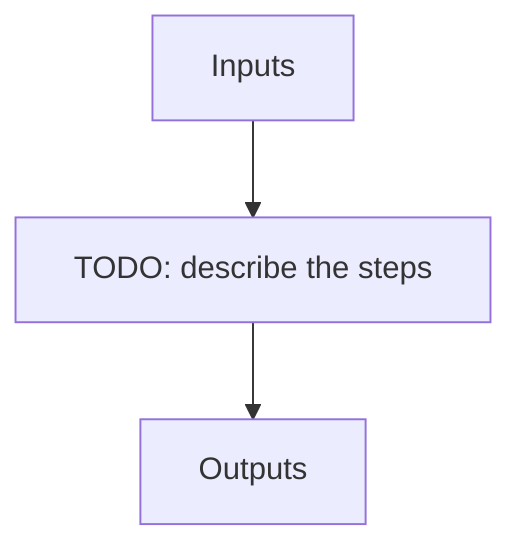

# Raw files (NIRPS_HA)

!!! warning "Undocumented"

    No description has been written for `Raw files` yet.

## Flow

<!-- Replace the diagram below with the real steps. -->

`HDR[XXX]` denotes a key read from the file header.

| name | description | HDR[TRG_TYPE] | HDR[HIERARCH ESO DPR TYPE] | HDR[HIERARCH ESO DPR CATG] | HDR[INSTRUME] | HDR[HIERARCH ESO INS MODE] |
| --- | --- | --- | --- | --- | --- | --- |
| RAW_DARK_DARK | Raw sci=DARK calib=DARK file | -- | DARK | CALIB | NIRPS | HA |
| RAW_EFF_SKY_SKY | Raw sci=SKY calib=SKY file (eff) | -- | EFF,SKY,SKY | CALIB | NIRPS | HA |
| RAW_NIGHT_SKY_SKY | Raw sci=SKY calib=SKY file (night) | NIGHT-SKY | OBJECT,SKY | -- | NIRPS | HA |
| RAW_DAY_SKY_SKY | Raw sci=SKY calib=SKY file (day) | SKY | OBJECT,SKY | -- | NIRPS | HA |
| RAW_DARK_FLAT | Raw sci=DARK calib=FP file | -- | ORDERDEF,DARK,LAMP | CALIB | NIRPS | HA |
| RAW_FLAT_DARK | Raw sci=FLAT calib=DARK file | -- | ORDERDEF,LAMP,DARK | CALIB | NIRPS | HA |
| RAW_FLAT_FLAT | Raw sci=FLAT calib=FLAT file | -- | FLAT,LAMP,LAMP | CALIB | NIRPS | HA |
| RAW_DARK_FP | Raw sci=DARK calib=FP file | -- | CONTAM,DARK,FP | CALIB | NIRPS | HA |
| RAW_FP_DARK | Raw sci=FP calib=DARK file | -- | CONTAM,FP,DARK | CALIB | NIRPS | HA |
| RAW_FP_FP | Raw sci=FP calib=FP file | -- | WAVE,FP,FP | CALIB | NIRPS | HA |
| RAW_LFC_LFC | Raw sci=LFC calib=LFC file | -- | WAVE,LFC,LFC | CALIB | NIRPS | HA |
| RAW_LFC_FP | Raw sci=LFC calib=FP file | -- | WAVE,LFC,FP | CALIB | NIRPS | HA |
| RAW_FP_LFC | Raw sci=FP calib=LFC file | -- | WAVE,FP,LFC | CALIB | NIRPS | HA |
| RAW_LFC_HCONE | Raw sci=LFC calib=HC1 file | -- | WAVE,LFC,UN1 | CALIB | NIRPS | HA |
| RAW_HCONE_LFC | Raw sci=HC1 calib=LFC file | -- | WAVE,UN1,LFC | CALIB | NIRPS | HA |
| RAW_LED_LED | -- | -- | LED,LAMP | CALIB | NIRPS | HA |
| RAW_FLAT_LED | -- | -- | FLAT,LED | CALIB | NIRPS | HA |
| RAW_OBJ_DARK | Raw sci=OBJ calib=DARK file | TARGET | OBJECT,DARK | -- | NIRPS | HA |
| RAW_OBJ_FP | Raw sci=OBJ calib=FP file | TARGET | OBJECT,FP | -- | NIRPS | HA |
| RAW_OBJ_HCONE | Raw sci=OBJ calib=Hollow Cathode file, Uranium Neon lamp | TARGET | OBJECT,UN1 | -- | NIRPS | HA |
| RAW_OBJ_SKY | Raw sci=OBJ calib=Sky file | TARGET | OBJECT,SKY | -- | NIRPS | HA |
| RAW_OBJ_TUN | -- | TARGET | OBJECT,TUN | -- | NIRPS | HA |
| RAW_SUN_FP | Raw sci=SUN calib=FP file | -- | SUN,FP,G2V | -- | NIRPS | HA |
| RAW_SUN_DARK | Raw sci=SUN calib=DARK file | -- | SUN,DARK,G2V | -- | NIRPS | HA |
| RAW_FLUXSTD_SKY | Raw sci=flux standard star calib=DARK file | -- | FLUX,STD,SKY | -- | NIRPS | HA |
| RAW_TELLU_SKY | Raw sci=hot star calib=DARK file | -- | TELLURIC,SKY | -- | NIRPS | HA |
| RAW_DARK_HCONE | Raw sci=DARK calib=Hollow Cathode file, where dark is an internal dark, Uranium Neon lamp | -- | WAVE,DARK,UN1 | CALIB | NIRPS | HA |
| RAW_FP_HCONE | Raw sci=FP calib=Hollow Cathode file, Uranium Neon lamp | -- | WAVE,FP,UN1 | CALIB | NIRPS | HA |
| RAW_HCONE_FP | Raw sci=Hollow Cathode calib=FP file, Uranium Neion lamp | -- | WAVE,UN1,FP | CALIB | NIRPS | HA |
| RAW_HCONE_HCONE | Raw sci=Hollow Cathode calib=Hollow Cathode file, Uranium Neon lamp | -- | WAVE,UN1,UN1 | CALIB | NIRPS | HA |
| RAW_HCONE_DARK | Raw sci=Hollow Cathode calib=DARK file, where dark is an internal dark, Uranium Neon lamp | -- | WAVE,UN1,DARK | CALIB | NIRPS | HA |
| RAW_DARK_HCTWO | Raw sci=DARK calib=Hollow Cathode file, where dark is an internal dark, Uranium Neon lamp | -- | WAVE,DARK,UN2 | CALIB | NIRPS | HA |
| RAW_FP_HCTWO | Raw sci=FP calib=Hollow Cathode file, Uranium Neon lamp | -- | WAVE,FP,UN2 | CALIB | NIRPS | HA |
| RAW_HCTWO_FP | Raw sci=Hollow Cathode calib=FP file, Uranium Neion lamp | -- | WAVE,UN2,FP | CALIB | NIRPS | HA |
| RAW_HCTWO_HCTWO | Raw sci=Hollow Cathode calib=Hollow Cathode file, Uranium Neon lamp | -- | WAVE,UN2,UN2 | CALIB | NIRPS | HA |
| RAW_HCTWO_DARK | Raw sci=Hollow Cathode calib=DARK file, where dark is an internal dark, Uranium Neon lamp | -- | WAVE,UN2,DARK | CALIB | NIRPS | HA |
| RAW_HCONE_HCTWO | Raw sci=Hollow Cathode calib=Hollow Cathode file, Uranium Neon lamp | -- | WAVE,UN1,UN2 | CALIB | NIRPS | HA |
| RAW_HCTWO_HCONE | Raw sci=Hollow Cathode calib=Hollow Cathode file, Uranium Neon lamp | -- | WAVE,UN2,UN1 | CALIB | NIRPS | HA |
| RAW_HCONE_LFC | Raw sci=Hollow Cathode calib=LFC file, Uranium Neon lamp | -- | WAVE,UN1,LFC | CALIB | NIRPS | HA |
| RAW_HCTWO_LFC | Raw sci=Hollow Cathode calib=LFC file, Uranium Neon lamp | -- | WAVE,UN2,LFC | CALIB | NIRPS | HA |
| RAW_CALIB_DARK_FLAT | Raw sci=DARK calib=FLAT test file | -- | FLAT,DARK,LAMP | CALIB | NIRPS | HA |
| RAW_CALIB_FLAT_DARK | Raw sci=FLAT calib=DARK test file | -- | FLAT,LAMP,DARK | CALIB | NIRPS | HA |
| RAW_TEST_DARK_FP | Raw sci=DARK calib=FP test file | -- | CONTAM,DARK,FP | TEST | NIRPS | HA |
| RAW_TEST_DARK_FLAT | Raw sci=DARK calib=FLAT test file | -- | FLAT,DARK,LAMP | TEST | NIRPS | HA |
| RAW_TEST_FLAT_DARK | Raw sci=FLAT calib=DARK test file | -- | FLAT,LAMP,DARK | TEST | NIRPS | HA |
| RAW_TEST_FP_FP | Raw sci=FP calib=FP test file | -- | WAVE,FP,FP | TEST | NIRPS | HA |
| RAW_TEST_LED_LED | Raw sci=LED calib=LED test file | -- | LED,LAMP | TEST | NIRPS | HA |
| RAW_TEST_HCONE_HCONE | Raw sci=Hollow Cathode calib=Hollow Cathode test file | -- | WAVE,UN1,UN1 | TEST | NIRPS | HA |
| RAW_TEST_FP_HCONE | Raw sci=FP calib=Hollow Cathode test file | -- | WAVE,FP,UN1 | TEST | NIRPS | HA |
| RAW_TEST_HCONE_FP | Raw sci=Hollow Cathode calib=FP test file | -- | WAVE,UN1,FP | TEST | NIRPS | HA |
| RAW_TEST_HCTWO_HCTWO | Raw sci=Hollow Cathode calib=Hollow Cathode test file | -- | WAVE,UN2,UN2 | TEST | NIRPS | HA |
| RAW_TEST_FP_HCTWO | Raw sci=FP calib=Hollow Cathode test file | -- | WAVE,FP,UN2 | TEST | NIRPS | HA |
| RAW_TEST_HCTWO_FP | Raw sci=Hollow Cathode calib=FP test file | -- | WAVE,UN2,FP | TEST | NIRPS | HA |
| RAW_TEST_EFF_SKY_SKY | Raw sci=SKY calib=SKY test file (eff) | -- | EFF,SKY,SKY | TEST | NIRPS | HA |
| RAW_TEST_NIGHT_SKY_SKY | Raw sci=SKY calib=SKY test file (night) | NIGHT-SKY | OBJECT,SKY | -- | NIRPS | HA |
| RAW_TEST_DARK | Raw sci=DARK calib=DARK test file | -- | DARK | TEST | NIRPS | HA |
| RAW_TEST_FP_DARK | Raw sci=FP calib=DARK test file | -- | CONTAM,FP,DARK | TEST | NIRPS | HA |
