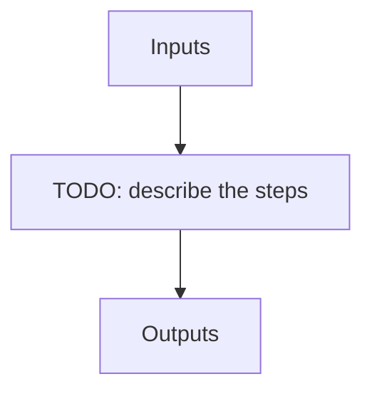

# apero_ccf_nirps_ha

**Short name:** CCF  **Type:** recipe  **Kind:** rv  **Instrument:** NIRPS_HA

Run the cross-correlation recipe in order to calculate the RV of an object.

## Flow

<!-- Replace the diagram below with the real steps. -->



## Usage

```bash
apero_ccf_nirps_ha.py {obs_dir}[STRING] [FILE:EXT_E2DS_FF,TELLU_OBJ] {options}
```

## Positional arguments

| Argument | Description |
| --- | --- |
| `{obs_dir}[STRING]` | [STRING] The directory to find the data files in. Most of the time this is organised by nightly observation directory |
| `[FILE:EXT_E2DS_FF,TELLU_OBJ]` | [STRING/STRINGS] A list of fits files to use separated by spaces. Currently allowed types: E2DS, E2DSFF, TELLU_OBJ (For dprtype = OBJ_FP, OBJ_DARK) |

## Optional arguments

| Argument | Description |
| --- | --- |
| `--mask[FILE:CCF_MASK]` | [STRING] Define the filename to the CCF mask to use. Can be full path or a file in the ./data/spirou/ccf/ folder |
| `--rv[FLOAT]` | [FLOAT] The target RV to use as a center for the CCF fit (in km/s) |
| `--width[FLOAT]` | [FLOAT] The CCF width to use for the CCF fit (in km/s) |
| `--step[FLOAT]` | [FLOAT] The CCF step to use for the CCF fit (in km/s) |
| `--masknormmode[None,all,order]` | [STRING] Define the type of normalization to apply to ccf masks, 'all' normalized across all orders, 'order' normalizes independently for each order, 'None' applies no mask normalization |
| `--database[True/False]` | [BOOLEAN] Whether to add outputs to calibration/telluric databases |
| `--blazefile[FILE:FF_BLAZE]` | [STRING] Define a custom file to use for blaze correction. If unset uses closest file from calibDB. Checks for an absolute path and then checks 'directory' (CALIBDB=BADPIX) |
| `--plot[0>INT>4]` | [INTEGER] Plot level. 0 = off, 1=save plots only, 2=interactive plots, 3=interactive with loop, 4=advanced mode |
| `--no_in_qc` | Disable checking the quality control of input files |

## Special arguments

<details>
<summary>Arguments common to all APERO recipes</summary>

| Argument | Description |
| --- | --- |
| `--xhelp[STRING]` | Extended help menu (with all advanced arguments) |
| `--debug[STRING]` | Activates debug mode (Advanced mode [INTEGER] value must be an integer greater than 0, setting the debug level) |
| `--list_night[STRING]` | Lists the night name directories in the input directory if used without a 'directory' argument or lists the files in the given 'directory' (if defined). Only lists up to 15 files/directories |
| `--list_all[STRING]` | Lists ALL the night name directories in the input directory if used without a 'directory' argument or lists the files in the given 'directory' (if defined) |
| `--version[STRING]` | Displays the current version of this recipe. |
| `--info[STRING]` | Displays the short version of the help menu |
| `--program[STRING]` | [STRING] The name of the program to display and use (mostly for logging purpose) log becomes date \| {THIS STRING} \| Message |
| `--recipe_kind[STRING]` | [STRING] The recipe kind for this recipe run (normally only used in apero_processing.py) |
| `--parallel[STRING]` | [BOOL] If True this is a run in parellel - disable some features (normally only used in apero_processing.py) |
| `--shortname[STRING]` | [STRING] Set a shortname for a recipe to distinguish it from other runs - this is mainly for use with apero processing but will appear in the log database |
| `--idebug[STRING]` | [BOOLEAN] If True always returns to ipython (or python) at end (via ipdb or pdb) |
| `--ref[STRING]` | If set then recipe is a reference recipe (e.g. reference recipes write to calibration database as reference calibrations) |
| `--crunfile[STRING]` | Set a run file to override default arguments |
| `--quiet[STRING]` | Run recipe without start up text |
| `--nosave` | Do not save any outputs (debug/information run). Note some recipes require other recipesto be run. Only use --nosave after previous recipe runs have been run successfully at least once. |
| `--force_indir[STRING]` | [STRING] Force the default input directory (Normally set by recipe) |
| `--force_outdir[STRING]` | [STRING] Force the default output directory (Normally set by recipe) |

</details>

## Outputs

**Output directory:** `PATH.RED // Default: "red" directory`

| name | description | HDR[DRSOUTID] | file type | suffix | fibers | input file |
| --- | --- | --- | --- | --- | --- | --- |
| CCF_RV | Cross-correlation RV results file | CCF_RV | .fits | _ccf | A, B | EXT_E2DS_FF, TELLU_OBJ |

## Plots

**Debug plots:**
`CCF_RV_FIT`, `CCF_RV_FIT_LOOP`, `CCF_SWAVE_REF`, `CCF_PHOTON_UNCERT`

**Summary plots:**
`SUM_CCF_PHOTON_UNCERT`, `SUM_CCF_RV_FIT`
