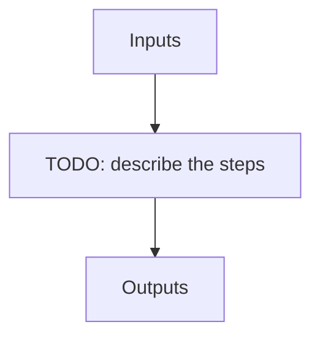

# apero_leak_ref_nirps_ha

**Short name:** LEAKREF  **Type:** recipe  **Kind:** calib-reference  **Instrument:** NIRPS_HA

Creates the reference dark_fp used for correcting the leakage from fiber C for extraction products

## Flow

<!-- Replace the diagram below with the real steps. -->



## Usage

```bash
apero_leak_ref_nirps_ha.py {obs_dir}[STRING] {options}
```

## Positional arguments

| Argument | Description |
| --- | --- |
| `{obs_dir}[STRING]` | [STRING] The directory to find the data files in. Most of the time this is organised by nightly observation directory |

## Optional arguments

| Argument | Description |
| --- | --- |
| `--filetype[STRING]` | [STRING] Specify the DPRTYPE for DARK_FP files |
| `--database[True/False]` | [BOOLEAN] Whether to add outputs to calibration/telluric databases |
| `--plot[0>INT>4]` | [INTEGER] Plot level. 0 = off, 1=save plots only, 2=interactive plots, 3=interactive with loop, 4=advanced mode |
| `--no_in_qc` | Disable checking the quality control of input files |
| `--forceext[True/False]` | If True, always re-extract the leak reference even if the output already exists (overrides CAL.LEAK.ALWAYS_EXTRACT) |

## Special arguments

<details>
<summary>Arguments common to all APERO recipes</summary>

| Argument | Description |
| --- | --- |
| `--xhelp[STRING]` | Extended help menu (with all advanced arguments) |
| `--debug[STRING]` | Activates debug mode (Advanced mode [INTEGER] value must be an integer greater than 0, setting the debug level) |
| `--list_night[STRING]` | Lists the night name directories in the input directory if used without a 'directory' argument or lists the files in the given 'directory' (if defined). Only lists up to 15 files/directories |
| `--list_all[STRING]` | Lists ALL the night name directories in the input directory if used without a 'directory' argument or lists the files in the given 'directory' (if defined) |
| `--version[STRING]` | Displays the current version of this recipe. |
| `--info[STRING]` | Displays the short version of the help menu |
| `--program[STRING]` | [STRING] The name of the program to display and use (mostly for logging purpose) log becomes date \| {THIS STRING} \| Message |
| `--recipe_kind[STRING]` | [STRING] The recipe kind for this recipe run (normally only used in apero_processing.py) |
| `--parallel[STRING]` | [BOOL] If True this is a run in parellel - disable some features (normally only used in apero_processing.py) |
| `--shortname[STRING]` | [STRING] Set a shortname for a recipe to distinguish it from other runs - this is mainly for use with apero processing but will appear in the log database |
| `--idebug[STRING]` | [BOOLEAN] If True always returns to ipython (or python) at end (via ipdb or pdb) |
| `--ref[STRING]` | If set then recipe is a reference recipe (e.g. reference recipes write to calibration database as reference calibrations) |
| `--crunfile[STRING]` | Set a run file to override default arguments |
| `--quiet[STRING]` | Run recipe without start up text |
| `--nosave` | Do not save any outputs (debug/information run). Note some recipes require other recipesto be run. Only use --nosave after previous recipe runs have been run successfully at least once. |
| `--force_indir[STRING]` | [STRING] Force the default input directory (Normally set by recipe) |
| `--force_outdir[STRING]` | [STRING] Force the default output directory (Normally set by recipe) |

</details>

## Outputs

**Output directory:** `PATH.RED // Default: "red" directory`

See the instrument [file definitions](/docs/apero/instruments/nirps_ha/file_definitions) for the full file catalogue.

| name | description | HDR[DRSOUTID] | file type | suffix | fibers | dbname | dbkey | input file |
| --- | --- | --- | --- | --- | --- | --- | --- | --- |
| EXT_E2DS_FF | Extracted + flat-fielded 2D spectrum | EXT_E2DS_FF | .fits | _e2dsff | A, B | -- | -- | DRS_PP |
| LEAKREF_E2DS | Reference leak correction calibration file | LEAKREF_E2DS | .fits | _leak_ref | A, B | calibration | LEAKREF | EXT_E2DS_FF, EXT_E2DS_FF |
