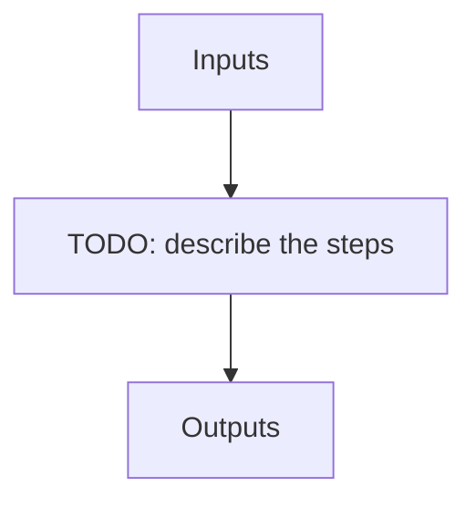

# apero_mk_template_nirps_ha

**Short name:** MKTEMP  **Type:** recipe  **Kind:** tellu  **Instrument:** NIRPS_HA

Telluric recipe to create template spectra (median of many observations) of the same object. Used to provide a better SED of stars in obj_mk_tellu and obj_fit_tellu. Note only needs to be run once for each science / hot star target.

## Flow

<!-- Replace the diagram below with the real steps. -->



## Usage

```bash
apero_mk_template_nirps_ha.py {objname}[STRING] {options}
```

## Positional arguments

| Argument | Description |
| --- | --- |
| `{objname}[STRING]` | [STRING] The object name to process |

## Optional arguments

| Argument | Description |
| --- | --- |
| `--filetype[EXT_E2DS,EXT_E2DS_FF,TELLU_OBJ]` | [STRING] optional, the filetype (KW_OUTPUT) to use when processing files |
| `--fiber[A,B]` | [STRING] optional, the fiber type to use when processing files |
| `--database[True/False]` | [BOOLEAN] Whether to add outputs to calibration/telluric databases |
| `--blazefile[FILE:FF_BLAZE]` | [STRING] Define a custom file to use for blaze correction. If unset uses closest file from calibDB. Checks for an absolute path and then checks 'directory' (CALIBDB=BADPIX) |
| `--plot[0>INT>4]` | [INTEGER] Plot level. 0 = off, 1=save plots only, 2=interactive plots, 3=interactive with loop, 4=advanced mode |
| `--wavefile[FILE:WAVESOL_REF,WAVE_NIGHT,WAVESOL_DEFAULT]` | [STRING] Define a custom file to use for the wave solution. If unset uses closest file from header or calibDB (depending on setup). Checks for an absolute path and then checks 'directory' |
| `--no_in_qc` | Disable checking the quality control of input files |

## Special arguments

<details>
<summary>Arguments common to all APERO recipes</summary>

| Argument | Description |
| --- | --- |
| `--xhelp[STRING]` | Extended help menu (with all advanced arguments) |
| `--debug[STRING]` | Activates debug mode (Advanced mode [INTEGER] value must be an integer greater than 0, setting the debug level) |
| `--list_night[STRING]` | Lists the night name directories in the input directory if used without a 'directory' argument or lists the files in the given 'directory' (if defined). Only lists up to 15 files/directories |
| `--list_all[STRING]` | Lists ALL the night name directories in the input directory if used without a 'directory' argument or lists the files in the given 'directory' (if defined) |
| `--version[STRING]` | Displays the current version of this recipe. |
| `--info[STRING]` | Displays the short version of the help menu |
| `--program[STRING]` | [STRING] The name of the program to display and use (mostly for logging purpose) log becomes date \| {THIS STRING} \| Message |
| `--recipe_kind[STRING]` | [STRING] The recipe kind for this recipe run (normally only used in apero_processing.py) |
| `--parallel[STRING]` | [BOOL] If True this is a run in parellel - disable some features (normally only used in apero_processing.py) |
| `--shortname[STRING]` | [STRING] Set a shortname for a recipe to distinguish it from other runs - this is mainly for use with apero processing but will appear in the log database |
| `--idebug[STRING]` | [BOOLEAN] If True always returns to ipython (or python) at end (via ipdb or pdb) |
| `--ref[STRING]` | If set then recipe is a reference recipe (e.g. reference recipes write to calibration database as reference calibrations) |
| `--crunfile[STRING]` | Set a run file to override default arguments |
| `--quiet[STRING]` | Run recipe without start up text |
| `--nosave` | Do not save any outputs (debug/information run). Note some recipes require other recipesto be run. Only use --nosave after previous recipe runs have been run successfully at least once. |
| `--force_indir[STRING]` | [STRING] Force the default input directory (Normally set by recipe) |
| `--force_outdir[STRING]` | [STRING] Force the default output directory (Normally set by recipe) |

</details>

## Outputs

**Output directory:** `PATH.RED // Default: "red" directory`

See the instrument [file definitions](/docs/apero/instruments/nirps_ha/file_definitions) for the full file catalogue.

| name | description | HDR[DRSOUTID] | file type | basename | fibers | dbname | dbkey | input file |
| --- | --- | --- | --- | --- | --- | --- | --- | --- |
| TELLU_TEMP | Telluric 2D template file | TELLU_TEMP | .fits | Template | A | telluric | TELLU_TEMP | EXT_E2DS_FF, TELLU_OBJ |
| TELLU_BIGCUBE | Telluric object 2D stack file (star frame) | TELLU_BIGCUBE | .fits | BigCube | A | -- | -- | EXT_E2DS_FF, TELLU_OBJ |
| TELLU_BIGCUBE0 | Telluric object  2D stack file (Earth frame) | TELLU_BIGCUBE0 | .fits | BigCube0 | A | -- | -- | EXT_E2DS_FF, TELLU_OBJ |
| TELLU_TEMP_S1DV | Telluric 1D template file | TELLU_TEMP_S1DV | .fits | Template_s1dv | A | telluric | TELLU_TEMP_S1DV | EXT_E2DS_FF, TELLU_OBJ |
| TELLU_TEMP_S1DW | Telluric 1D template file | TELLU_TEMP_S1DW | .fits | Template_s1dw | A | telluric | TELLU_TEMP_S1DW | EXT_E2DS_FF, TELLU_OBJ |
| TELLU_BIGCUBE_S1D | Telluric object 1D stack file (Earth frame) | TELLU_BIGCUBE_S1D | .fits | BigCube_s1d | A | -- | -- | EXT_E2DS_FF, TELLU_OBJ |

## Plots

**Debug plots:**
`EXTRACT_S1D`, `MKTEMP_BERV_COV`, `MKTEMP_S1D_DECONV`

**Summary plots:**
`SUM_EXTRACT_S1D`, `SUM_MKTEMP_BERV_COV`
