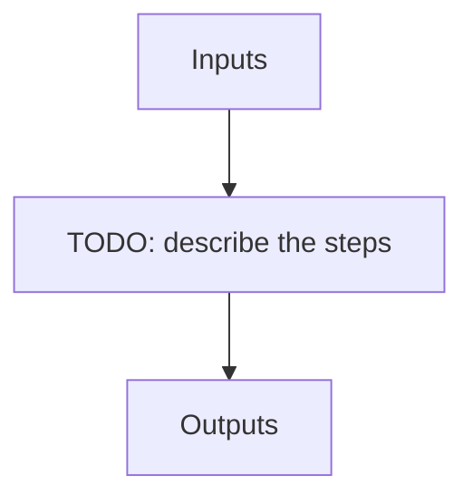

# apero_wave_night_nirps_ha

**Short name:** WAVE  **Type:** recipe  **Kind:** calib-night  **Instrument:** NIRPS_HA

Wavelength solution finding recipe for NIRPS HA.

 Uses HCONE_HCONE to find an initial solution and optionally FP_FP files to find more accurate solution.

## Flow

<!-- Replace the diagram below with the real steps. -->



## Usage

```bash
apero_wave_night_nirps_ha.py {obs_dir}[STRING] --hcfiles[FILE:HCONE_HCONE] --fpfiles[FILE:FP_FP] {options}
```

## Positional arguments

| Argument | Description |
| --- | --- |
| `{obs_dir}[STRING]` | [STRING] The directory to find the data files in. Most of the time this is organised by nightly observation directory |
| `--hcfiles[FILE:HCONE_HCONE]` | Current allowed types: HC1_HC1 |
| `--fpfiles[FILE:FP_FP]` | Current allowed types: FP_FP |

## Optional arguments

| Argument | Description |
| --- | --- |
| `--database[True/False]` | [BOOLEAN] Whether to add outputs to calibration/telluric databases |
| `--badpixfile[FILE:BADPIX]` | [STRING] Define a custom file to use for bad pixel correction. Checks for an absolute path and then checks 'directory' |
| `--badcorr[True/False]` | [BOOLEAN] Whether to correct for the bad pixel file |
| `--backsub[True/False]` | [BOOLEAN] Whether to do background subtraction |
| `--blazefile[FILE:FF_BLAZE]` | [STRING] Define a custom file to use for blaze correction. If unset uses closest file from calibDB. Checks for an absolute path and then checks 'directory' (CALIBDB=BADPIX) |
| `--combine[True/False]` | [BOOLEAN] Whether to combine fits files in file list or to process them separately |
| `--darkfile[FILE:DARKREF]` | [STRING] The Dark file to use (CALIBDB=DARKM) |
| `--darkcorr[True/False]` | [BOOLEAN] Whether to correct for the dark file |
| `--flipimage[True/False]` | [BOOLEAN] Whether to flip fits image |
| `--fluxunits[ADU/s,e-]` | [STRING] Output units for flux |
| `--locofile[FILE:LOC_LOCO]` | [STRING] Sets the LOCO file used to get the coefficients (CALIBDB=LOC_{fiber}) |
| `--orderpfile[FILE:LOC_LOCO]` | [STRING] Sets the Order Profile file used to get the coefficients (CALIBDB=ORDER_PROFILE_{fiber} |
| `--plot[0>INT>4]` | [INTEGER] Plot level. 0 = off, 1=save plots only, 2=interactive plots, 3=interactive with loop, 4=advanced mode |
| `--resize[True/False]` | [BOOLEAN] Whether to resize image |
| `--shapex[FILE:SHAPE_X]` | [STRING] Sets the SHAPE DXMAP file used to get the dx correction map (CALIBDB=SHAPEX) |
| `--shapey[FILE:SHAPE_Y]` | [STRING] Sets the SHAPE DYMAP file used to get the dy correction map (CALIBDB=SHAPEY) |
| `--shapel[FILE:SHAPEL]` | [STRING] Sets the SHAPE local file used to get the local transforms (CALIBDB = SHAPEL) |
| `--wavefile[FILE:WAVESOL_REF,WAVE_NIGHT,WAVESOL_DEFAULT]` | [STRING] Define a custom file to use for the wave solution. If unset uses closest file from header or calibDB (depending on setup). Checks for an absolute path and then checks 'directory' |
| `--forceext[True/False]` | WAVE_EXTRACT_HELP |
| `--no_in_qc` | Disable checking the quality control of input files |

## Special arguments

<details>
<summary>Arguments common to all APERO recipes</summary>

| Argument | Description |
| --- | --- |
| `--xhelp[STRING]` | Extended help menu (with all advanced arguments) |
| `--debug[STRING]` | Activates debug mode (Advanced mode [INTEGER] value must be an integer greater than 0, setting the debug level) |
| `--list_night[STRING]` | Lists the night name directories in the input directory if used without a 'directory' argument or lists the files in the given 'directory' (if defined). Only lists up to 15 files/directories |
| `--list_all[STRING]` | Lists ALL the night name directories in the input directory if used without a 'directory' argument or lists the files in the given 'directory' (if defined) |
| `--version[STRING]` | Displays the current version of this recipe. |
| `--info[STRING]` | Displays the short version of the help menu |
| `--program[STRING]` | [STRING] The name of the program to display and use (mostly for logging purpose) log becomes date \| {THIS STRING} \| Message |
| `--recipe_kind[STRING]` | [STRING] The recipe kind for this recipe run (normally only used in apero_processing.py) |
| `--parallel[STRING]` | [BOOL] If True this is a run in parellel - disable some features (normally only used in apero_processing.py) |
| `--shortname[STRING]` | [STRING] Set a shortname for a recipe to distinguish it from other runs - this is mainly for use with apero processing but will appear in the log database |
| `--idebug[STRING]` | [BOOLEAN] If True always returns to ipython (or python) at end (via ipdb or pdb) |
| `--ref[STRING]` | If set then recipe is a reference recipe (e.g. reference recipes write to calibration database as reference calibrations) |
| `--crunfile[STRING]` | Set a run file to override default arguments |
| `--quiet[STRING]` | Run recipe without start up text |
| `--nosave` | Do not save any outputs (debug/information run). Note some recipes require other recipesto be run. Only use --nosave after previous recipe runs have been run successfully at least once. |
| `--force_indir[STRING]` | [STRING] Force the default input directory (Normally set by recipe) |
| `--force_outdir[STRING]` | [STRING] Force the default output directory (Normally set by recipe) |

</details>

## Outputs

**Output directory:** `PATH.RED // Default: "red" directory`

| name | description | HDR[DRSOUTID] | file type | suffix | fibers | dbname | dbkey | input file |
| --- | --- | --- | --- | --- | --- | --- | --- | --- |
| EXT_E2DS_FF | Extracted + flat-fielded 2D spectrum | EXT_E2DS_FF | .fits | _e2dsff | A, B | -- | -- | DRS_PP |
| WAVE_NIGHT | Nightly wavelength solution calibration file | WAVE_NIGHT | .fits | _wave_night | A, B | calibration | WAVE | EXT_E2DS_FF, EXT_E2DS_FF |
| WAVE_HCLIST | Nightly wavelength Hollow cathodeline-list table | WAVE_HCLIST | .fits | _wave_hclines | A, B | -- | -- | EXT_E2DS_FF, EXT_E2DS_FF |
| WAVE_FPLIST | Nightly wavelength FP line-list calibration file | WAVE_FPLIST | .fits | _wave_fplines | A, B | -- | -- | EXT_E2DS_FF, EXT_E2DS_FF |
| CCF_RV | Cross-correlation RV results file | CCF_RV | .fits | _ccf | A, B | -- | -- | EXT_E2DS_FF, TELLU_OBJ |

## Plots

**Debug plots:**
`WAVE_WL_CAV`, `WAVE_FIBER_COMPARISON`, `WAVE_FIBER_COMP`, `WAVE_HC_DIFF_HIST`, `WAVEREF_EXPECTED`, `EXTRACT_S1D`, `EXTRACT_S1D_WEIGHT`, `WAVE_RESMAP`, `WAVE_SLINKY_EW_COV`, `WAVE_SLINKY_FIT`, `CCF_PHOTON_UNCERT`, `CCF_RV_FIT`, `CCF_RV_FIT_LOOP`

**Summary plots:**
`SUM_WAVE_FIBER_COMP`, `SUM_CCF_RV_FIT`, `SUM_CCF_PHOTON_UNCERT`
