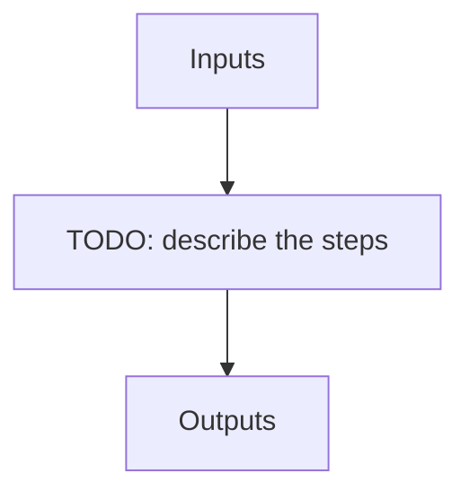

# calib_seq

**Instrument:** NIRPS_HA

!!! warning "Undocumented"

    No description has been written for `calib_seq` yet.

## Flow

<!-- Replace the diagram below with the real steps. -->

## Recipes in this sequence

| ORDER | RECIPE | SHORTNAME | RECIPE KIND | REF RECIPE | ARGS |
| --- | --- | --- | --- | --- | --- |
| 1 | apero_badpix_nirps_ha.py | BAD | calib-night | No |  |
| 2 | apero_loc_nirps_ha.py | LOC | calib-night | No | {files}=[DARK_FLAT, CALIB_DARK_FLAT, FLAT_DARK, CALIB_FLAT_DARK] |
| 3 | apero_shape_nirps_ha.py | SHAPE | calib-night | No |  |
| 4 | apero_flat_nirps_ha.py | FF | calib-night | No | {files}=[FLAT_FLAT, DARK_FLAT, FLAT_DARK, CALIB_FLAT_DARK, CALIB_DARK_FLAT] |
| 5 | apero_wave_night_nirps_ha.py | WAVE | calib-night | No |  |
