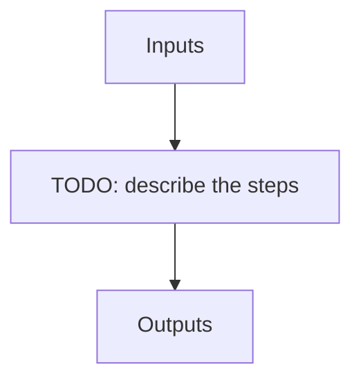

# eng_seq

**Instrument:** NIRPS_HA

!!! warning "Undocumented"

    No description has been written for `eng_seq` yet.

## Flow

<!-- Replace the diagram below with the real steps. -->

## Recipes in this sequence

| ORDER | RECIPE | SHORTNAME | RECIPE KIND | REF RECIPE | ARGS |
| --- | --- | --- | --- | --- | --- |
| 1 | apero_extract_nirps_ha.py | EXT_HC1HC1 | extract-hchc | No | {files}=[HCONE_HCONE] |
| 2 | apero_extract_nirps_ha.py | EXT_FPFP | extract-fpfp | No | {files}=[FP_FP] |
| 3 | apero_extract_nirps_ha.py | EXT_FF | extract-ff | No | {files}=[FLAT_FLAT] |
| 4 | apero_extract_nirps_ha.py | EXT_DFP | extract-dfp | No | {files}=[DARK_FP] |
| 5 | apero_extract_nirps_ha.py | EXT_SKY | extract-sky | No | {files}=[EFF_SKY_SKY, TEST_DARK_DARK_SKY, NIGHT_SKY_SKY] |
| 6 | apero_extract_nirps_ha.py | EXT_LFC | extract-lfc | No | {files}=[LFC_LFC] |
| 7 | apero_extract_nirps_ha.py | EXT_FPD | extract-fpd | No | {files}=[FP_DARK] |
| 8 | apero_extract_nirps_ha.py | EXT_LFCFP | extract-lfcfp | No | {files}=[LFC_FP] |
| 9 | apero_extract_nirps_ha.py | EXT_FPLFC | extract-fplfc | No | {files}=[FP_LFC] |
| 10 | apero_extract_nirps_ha.py | EXT_FPHC1 | extract-fphc1 | No | {files}=[FP_HCONE] |
| 11 | apero_extract_nirps_ha.py | EXT_HC1FP | extract-hc1fp | No | {files}=[HCONE_FP] |
| 12 | apero_extract_nirps_ha.py | EXT_EVERY | extract-everything | No | {files}=[DRS_PP] |
