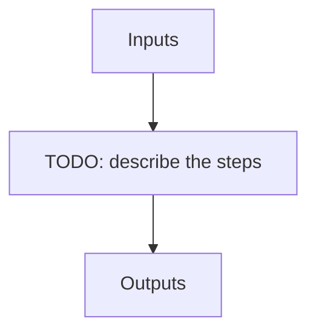

# full_seq

**Instrument:** NIRPS_HA

!!! warning "Undocumented"

    No description has been written for `full_seq` yet.

## Flow

<!-- Replace the diagram below with the real steps. -->

## Recipes in this sequence

| ORDER | RECIPE | SHORTNAME | RECIPE KIND | REF RECIPE | FIBER | FILTERS | ARGS | KWARGS |
| --- | --- | --- | --- | --- | --- | --- | --- | --- |
| 1 | apero_pp_ref_nirps_ha.py | PPREF | pre-reference | Yes | -- | -- |  |  |
| 2 | apero_preprocess_nirps_ha.py | PP | pre-all | No | -- | -- |  |  |
| 3 | apero_dark_ref_nirps_ha.py | DARKREF | calib-reference | Yes | -- | -- |  |  |
| 4 | apero_badpix_nirps_ha.py | BADREF | calib-reference | Yes | -- | -- |  |  |
| 5 | apero_loc_nirps_ha.py | LOCREF | calib-reference | Yes | -- | -- | {files}=[DARK_FLAT, CALIB_DARK_FLAT, FLAT_DARK, CALIB_FLAT_DARK] |  |
| 6 | apero_shape_ref_nirps_ha.py | SHAPEREF | calib-reference | Yes | -- | -- |  |  |
| 7 | apero_shape_nirps_ha.py | SHAPELREF | calib-reference | Yes | -- | -- |  |  |
| 8 | apero_flat_nirps_ha.py | FLATREF | calib-reference | Yes | -- | -- |  |  |
| 9 | apero_leak_ref_nirps_ha.py | LEAKREF | calib-reference | Yes | -- | -- |  |  |
| 10 | apero_wave_ref_nirps_ha.py | WAVEREF | calib-reference | Yes | -- | -- |  | --hcfiles=[HCONE_HCONE] \|br\| --fpfiles=[FP_FP] |
| 11 | apero_badpix_nirps_ha.py | BAD | calib-night | No | -- | -- |  |  |
| 12 | apero_loc_nirps_ha.py | LOC | calib-night | No | -- | -- | {files}=[DARK_FLAT, CALIB_DARK_FLAT, FLAT_DARK, CALIB_FLAT_DARK] |  |
| 13 | apero_shape_nirps_ha.py | SHAPE | calib-night | No | -- | -- |  |  |
| 14 | apero_flat_nirps_ha.py | FF | calib-night | No | -- | -- | {files}=[FLAT_FLAT, DARK_FLAT, FLAT_DARK, CALIB_FLAT_DARK, CALIB_DARK_FLAT] |  |
| 15 | apero_wave_night_nirps_ha.py | WAVE | calib-night | No | -- | -- |  |  |
| 16 | apero_extract_nirps_ha.py | EXTALL | extract-ALL | No | -- | -- | {files}=[OBJ_DARK, OBJ_FP, OBJ_SKY, OBJ_TUN, FLUXSTD_SKY, TELLU_SKY] |  |
| 17 | apero_mk_tellu_nirps_ha.py | MKTELLU1 | tellu-hotstar | No | A | KW_OBJNAME: TELLURIC_TARGETS \|br\| KW_DPRTYPE: OBJ_DARK, OBJ_FP, OBJ_SKY, OBJ_TUN, FLUXSTD_SKY, TELLU_SKY | {files}=[EXT_E2DS_FF] |  |
| 18 | apero_mk_model_nirps_ha.py | MKTMOD1 | tellu-hotstar | No | -- | -- |  |  |
| 19 | apero_fit_tellu_nirps_ha.py | MKTFIT1 | tellu-hotstar | No | A | KW_OBJNAME: TELLURIC_TARGETS \|br\| KW_DPRTYPE: OBJ_DARK, OBJ_FP, OBJ_SKY, OBJ_TUN, FLUXSTD_SKY, TELLU_SKY | {files}=[EXT_E2DS_FF] |  |
| 20 | apero_mk_template_nirps_ha.py | MKTEMP1 | tellu-hotstar | No | A | KW_OBJNAME: TELLURIC_TARGETS \|br\| KW_DPRTYPE: OBJ_DARK, OBJ_FP, OBJ_SKY, OBJ_TUN, FLUXSTD_SKY, TELLU_SKY |  |  |
| 21 | apero_mk_tellu_nirps_ha.py | MKTELLU2 | tellu-hotstar | No | A | KW_OBJNAME: TELLURIC_TARGETS \|br\| KW_DPRTYPE: OBJ_DARK, OBJ_FP, OBJ_SKY, OBJ_TUN, FLUXSTD_SKY, TELLU_SKY | {files}=[EXT_E2DS_FF] |  |
| 22 | apero_mk_model_nirps_ha.py | MKTMOD2 | tellu-hotstar | No | -- | -- |  |  |
| 23 | apero_fit_tellu_nirps_ha.py | MKTFIT2 | tellu-hotstar | No | A | KW_OBJNAME: TELLURIC_TARGETS \|br\| KW_DPRTYPE: OBJ_DARK, OBJ_FP, OBJ_SKY, OBJ_TUN, FLUXSTD_SKY, TELLU_SKY | {files}=[EXT_E2DS_FF] |  |
| 24 | apero_mk_template_nirps_ha.py | MKTEMP2 | tellu-hotstar | No | A | KW_OBJNAME: TELLURIC_TARGETS \|br\| KW_DPRTYPE: OBJ_DARK, OBJ_FP, OBJ_SKY, OBJ_TUN, FLUXSTD_SKY, TELLU_SKY |  |  |
| 25 | apero_fit_tellu_nirps_ha.py | FTFIT1 | tellu-science | No | A | KW_OBJNAME: SCIENCE_TARGETS \|br\| KW_DPRTYPE: OBJ_DARK, OBJ_FP, OBJ_SKY, OBJ_TUN, FLUXSTD_SKY, TELLU_SKY | {files}=[EXT_E2DS_FF] |  |
| 26 | apero_mk_template_nirps_ha.py | FTTEMP1 | tellu-science | No | A | KW_OBJNAME: SCIENCE_TARGETS \|br\| KW_DPRTYPE: OBJ_DARK, OBJ_FP, OBJ_SKY, OBJ_TUN, FLUXSTD_SKY, TELLU_SKY |  |  |
| 27 | apero_fit_tellu_nirps_ha.py | FTFIT2 | tellu-science | No | A | KW_OBJNAME: SCIENCE_TARGETS \|br\| KW_DPRTYPE: OBJ_DARK, OBJ_FP, OBJ_SKY, OBJ_TUN, FLUXSTD_SKY, TELLU_SKY | {files}=[EXT_E2DS_FF] |  |
| 28 | apero_mk_template_nirps_ha.py | FTTEMP2 | tellu-science | No | A | KW_OBJNAME: SCIENCE_TARGETS \|br\| KW_DPRTYPE: OBJ_DARK, OBJ_FP, OBJ_SKY, OBJ_TUN, FLUXSTD_SKY, TELLU_SKY |  |  |
| 29 | apero_ccf_nirps_ha.py | CCF | rv-tcorr | No | A | KW_DPRTYPE: OBJ_DARK, OBJ_FP, OBJ_SKY, OBJ_TUN, FLUXSTD_SKY, TELLU_SKY | {files}=[TELLU_OBJ] |  |
| 30 | apero_lbl_ref_nirps_ha.py | LBLREF | lbl-ref | No | -- | -- |  |  |
| 31 | apero_lbl_mask_nirps_ha.py | LBLMASK_FP | lbl-mask-fp | No | -- | -- |  |  |
| 32 | apero_lbl_compute_nirps_ha.py | LBLCOMPUTE_FP | lbl-compute-fp | No | -- | -- |  |  |
| 33 | apero_lbl_compile_nirps_ha.py | LBLCOMPILE_FP | lbl-compile-fp | No | -- | -- |  |  |
| 34 | apero_lbl_mask_nirps_ha.py | LBLMASK_SCI | lbl-mask-sci | No | -- | KW_OBJNAME: SCIENCE_TARGETS |  |  |
| 35 | apero_lbl_compute_nirps_ha.py | LBLCOMPUTE_SCI | lbl-compute-sci | No | -- | KW_OBJNAME: SCIENCE_TARGETS |  |  |
| 36 | apero_lbl_compile_nirps_ha.py | LBLCOMPILE_SCI | lbl-compile-sci | No | -- | KW_OBJNAME: SCIENCE_TARGETS |  |  |
| 37 | apero_postprocess_nirps_ha.py | POSTALL | post-all | No | -- | KW_DPRTYPE: OBJ_DARK, OBJ_FP, OBJ_SKY, OBJ_TUN, FLUXSTD_SKY, TELLU_SKY | {files}=[DRS_PP] |  |
