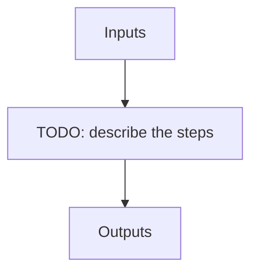

# helios_seq

**Instrument:** NIRPS_HA

!!! warning "Undocumented"

    No description has been written for `helios_seq` yet.

## Flow

<!-- Replace the diagram below with the real steps. -->

## Recipes in this sequence

| ORDER | RECIPE | SHORTNAME | RECIPE KIND | REF RECIPE | ARGS |
| --- | --- | --- | --- | --- | --- |
| 1 | apero_preprocess_nirps_ha.py | PP_SUN | pre-sun | No | {files}=[RAW_SUN_FP, RAW_SUN_DARK] |
| 2 | apero_extract_nirps_ha.py | EXT_SUN | extract-sun | No | {files}=[SUN_FP, SUN_DARK] |
