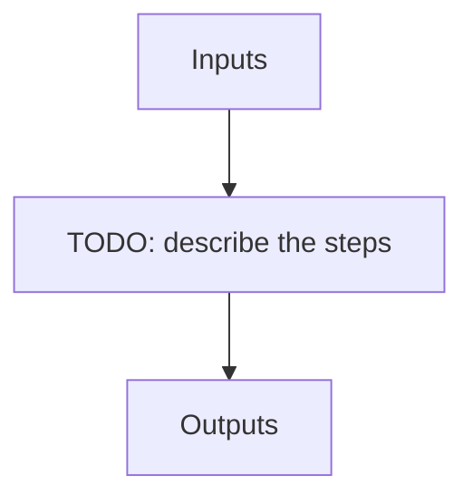

# lbl_seq

**Instrument:** NIRPS_HA

!!! warning "Undocumented"

    No description has been written for `lbl_seq` yet.

## Flow

<!-- Replace the diagram below with the real steps. -->

## Recipes in this sequence

| ORDER | RECIPE | SHORTNAME | RECIPE KIND | REF RECIPE | FILTERS |
| --- | --- | --- | --- | --- | --- |
| 1 | apero_lbl_ref_nirps_ha.py | LBLREF | lbl-ref | No | -- |
| 2 | apero_lbl_mask_nirps_ha.py | LBLMASK_SCI | lbl-mask-sci | No | KW_OBJNAME: SCIENCE_TARGETS |
| 3 | apero_lbl_compute_nirps_ha.py | LBLCOMPUTE_SCI | lbl-compute-sci | No | KW_OBJNAME: SCIENCE_TARGETS |
| 4 | apero_lbl_compile_nirps_ha.py | LBLCOMPILE_SCI | lbl-compile-sci | No | KW_OBJNAME: SCIENCE_TARGETS |
