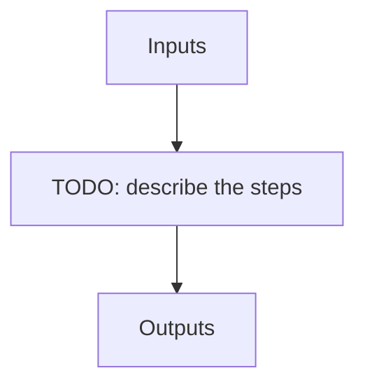

# pp_seq

**Instrument:** NIRPS_HA

!!! warning "Undocumented"

    No description has been written for `pp_seq` yet.

## Flow

<!-- Replace the diagram below with the real steps. -->

## Recipes in this sequence

| ORDER | RECIPE | SHORTNAME | RECIPE KIND | REF RECIPE |
| --- | --- | --- | --- | --- |
| 1 | apero_pp_ref_nirps_ha.py | PPREF | pre-reference | Yes |
| 2 | apero_preprocess_nirps_ha.py | PP | pre | No |
