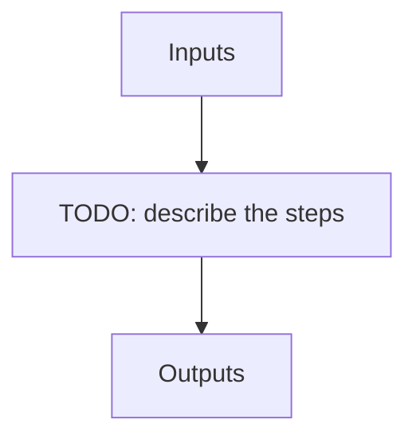

# quick_seq

**Instrument:** NIRPS_HA

!!! warning "Undocumented"

    No description has been written for `quick_seq` yet.

## Flow

<!-- Replace the diagram below with the real steps. -->

## Recipes in this sequence

| ORDER | RECIPE | SHORTNAME | RECIPE KIND | REF RECIPE | FILTERS | ARGS |
| --- | --- | --- | --- | --- | --- | --- |
| 1 | apero_extract_nirps_ha.py | EXTQUICK | extract-quick | No | KW_OBJNAME: SCIENCE_TARGETS \|br\| KW_DPRTYPE: OBJ_DARK, OBJ_FP, OBJ_SKY, OBJ_TUN, FLUXSTD_SKY, TELLU_SKY | {files}=[OBJ_DARK, OBJ_FP, OBJ_SKY, OBJ_TUN, FLUXSTD_SKY, TELLU_SKY] |
