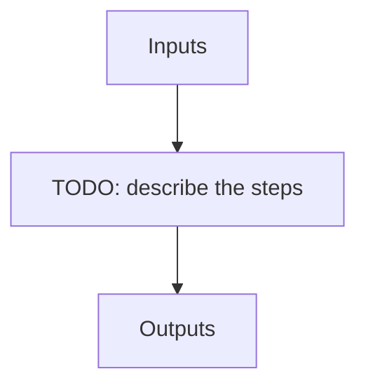

# science_seq

**Instrument:** NIRPS_HA

!!! warning "Undocumented"

    No description has been written for `science_seq` yet.

## Flow

<!-- Replace the diagram below with the real steps. -->

## Recipes in this sequence

| ORDER | RECIPE | SHORTNAME | RECIPE KIND | REF RECIPE | FIBER | FILTERS | ARGS |
| --- | --- | --- | --- | --- | --- | --- | --- |
| 1 | apero_extract_nirps_ha.py | EXTOBJ | extract-science | No | -- | KW_OBJNAME: SCIENCE_TARGETS \|br\| KW_DPRTYPE: OBJ_DARK, OBJ_FP, OBJ_SKY, OBJ_TUN, FLUXSTD_SKY, TELLU_SKY | {files}=[OBJ_DARK, OBJ_FP, OBJ_SKY, OBJ_TUN, FLUXSTD_SKY, TELLU_SKY] |
| 2 | apero_fit_tellu_nirps_ha.py | FTFIT1 | tellu-science | No | A | KW_OBJNAME: SCIENCE_TARGETS \|br\| KW_DPRTYPE: OBJ_DARK, OBJ_FP, OBJ_SKY, OBJ_TUN, FLUXSTD_SKY, TELLU_SKY | {files}=[EXT_E2DS_FF] |
| 3 | apero_mk_template_nirps_ha.py | FTTEMP1 | tellu-science | No | A | KW_OBJNAME: SCIENCE_TARGETS \|br\| KW_DPRTYPE: OBJ_DARK, OBJ_FP, OBJ_SKY, OBJ_TUN, FLUXSTD_SKY, TELLU_SKY |  |
| 4 | apero_fit_tellu_nirps_ha.py | FTFIT2 | tellu-science | No | A | KW_OBJNAME: SCIENCE_TARGETS \|br\| KW_DPRTYPE: OBJ_DARK, OBJ_FP, OBJ_SKY, OBJ_TUN, FLUXSTD_SKY, TELLU_SKY | {files}=[EXT_E2DS_FF] |
| 5 | apero_mk_template_nirps_ha.py | FTTEMP2 | tellu-science | No | A | KW_OBJNAME: SCIENCE_TARGETS \|br\| KW_DPRTYPE: OBJ_DARK, OBJ_FP, OBJ_SKY, OBJ_TUN, FLUXSTD_SKY, TELLU_SKY |  |
| 6 | apero_ccf_nirps_ha.py | CCF | rv-tcorr | No | A | KW_DPRTYPE: OBJ_DARK, OBJ_FP, OBJ_SKY, OBJ_TUN, FLUXSTD_SKY, TELLU_SKY \|br\| KW_OBJNAME: SCIENCE_TARGETS | {files}=[TELLU_OBJ] |
| 7 | apero_lbl_ref_nirps_ha.py | LBLREF | lbl-ref | No | -- | -- |  |
| 8 | apero_lbl_mask_nirps_ha.py | LBLMASK_FP | lbl-mask-fp | No | -- | -- |  |
| 9 | apero_lbl_compute_nirps_ha.py | LBLCOMPUTE_FP | lbl-compute-fp | No | -- | -- |  |
| 10 | apero_lbl_compile_nirps_ha.py | LBLCOMPILE_FP | lbl-compile-fp | No | -- | -- |  |
| 11 | apero_lbl_mask_nirps_ha.py | LBLMASK_SCI | lbl-mask-sci | No | -- | KW_OBJNAME: SCIENCE_TARGETS |  |
| 12 | apero_lbl_compute_nirps_ha.py | LBLCOMPUTE_SCI | lbl-compute-sci | No | -- | KW_OBJNAME: SCIENCE_TARGETS |  |
| 13 | apero_lbl_compile_nirps_ha.py | LBLCOMPILE_SCI | lbl-compile-sci | No | -- | KW_OBJNAME: SCIENCE_TARGETS |  |
| 14 | apero_postprocess_nirps_ha.py | SCIPOST | post-science | No | -- | KW_DPRTYPE: OBJ_DARK, OBJ_FP, OBJ_SKY, OBJ_TUN, FLUXSTD_SKY, TELLU_SKY \|br\| KW_OBJNAME: SCIENCE_TARGETS | {files}=[DRS_PP] |
