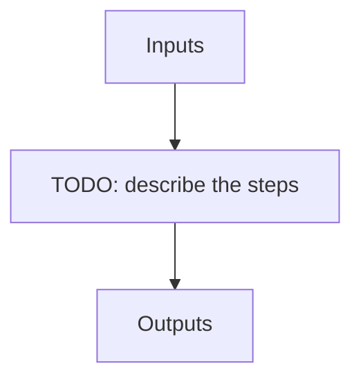

# tellu_seq

**Instrument:** NIRPS_HA

!!! warning "Undocumented"

    No description has been written for `tellu_seq` yet.

## Flow

<!-- Replace the diagram below with the real steps. -->

## Recipes in this sequence

| ORDER | RECIPE | SHORTNAME | RECIPE KIND | REF RECIPE | FIBER | FILTERS | ARGS |
| --- | --- | --- | --- | --- | --- | --- | --- |
| 1 | apero_extract_nirps_ha.py | EXTTELL | extract-hotstar | No | -- | KW_OBJNAME: TELLURIC_TARGETS \|br\| KW_DPRTYPE: OBJ_DARK, OBJ_FP, OBJ_SKY, OBJ_TUN, FLUXSTD_SKY, TELLU_SKY | {files}=[OBJ_DARK, OBJ_FP, OBJ_SKY, OBJ_TUN, FLUXSTD_SKY, TELLU_SKY] |
| 2 | apero_mk_tellu_nirps_ha.py | MKTELLU1 | tellu-hotstar | No | A | KW_OBJNAME: TELLURIC_TARGETS \|br\| KW_DPRTYPE: OBJ_DARK, OBJ_FP, OBJ_SKY, OBJ_TUN, FLUXSTD_SKY, TELLU_SKY | {files}=[EXT_E2DS_FF] |
| 3 | apero_mk_model_nirps_ha.py | MKTMOD1 | tellu-hotstar | No | -- | -- |  |
| 4 | apero_fit_tellu_nirps_ha.py | MKTFIT1 | tellu-hotstar | No | A | KW_OBJNAME: TELLURIC_TARGETS \|br\| KW_DPRTYPE: OBJ_DARK, OBJ_FP, OBJ_SKY, OBJ_TUN, FLUXSTD_SKY, TELLU_SKY | {files}=[EXT_E2DS_FF] |
| 5 | apero_mk_template_nirps_ha.py | MKTEMP1 | tellu-hotstar | No | A | KW_OBJNAME: TELLURIC_TARGETS \|br\| KW_DPRTYPE: OBJ_DARK, OBJ_FP, OBJ_SKY, OBJ_TUN, FLUXSTD_SKY, TELLU_SKY | {files}=[EXT_E2DS_FF] |
| 6 | apero_mk_tellu_nirps_ha.py | MKTELLU2 | tellu-hotstar | No | A | KW_OBJNAME: TELLURIC_TARGETS \|br\| KW_DPRTYPE: OBJ_DARK, OBJ_FP, OBJ_SKY, OBJ_TUN, FLUXSTD_SKY, TELLU_SKY | {files}=[EXT_E2DS_FF] |
| 7 | apero_mk_model_nirps_ha.py | MKTMOD2 | tellu-hotstar | No | -- | -- |  |
| 8 | apero_fit_tellu_nirps_ha.py | MKTFIT2 | tellu-hotstar | No | A | KW_OBJNAME: TELLURIC_TARGETS \|br\| KW_DPRTYPE: OBJ_DARK, OBJ_FP, OBJ_SKY, OBJ_TUN, FLUXSTD_SKY, TELLU_SKY | {files}=[EXT_E2DS_FF] |
| 9 | apero_mk_template_nirps_ha.py | MKTEMP2 | tellu-hotstar | No | A | KW_OBJNAME: TELLURIC_TARGETS \|br\| KW_DPRTYPE: OBJ_DARK, OBJ_FP, OBJ_SKY, OBJ_TUN, FLUXSTD_SKY, TELLU_SKY | {files}=[EXT_E2DS_FF] |
