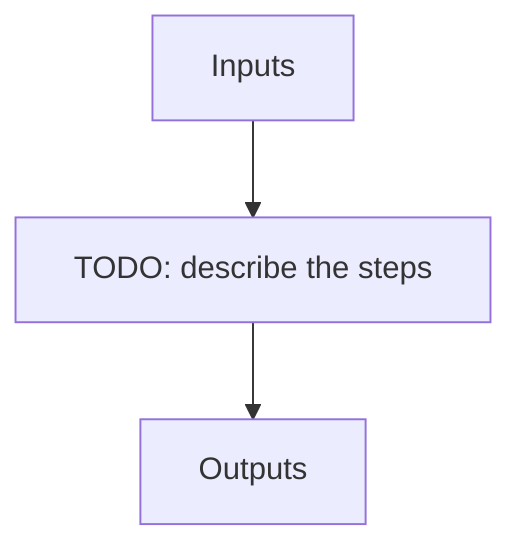

# apero_flat_nirps_he

**Short name:** FF  **Type:** recipe  **Kind:** calib-night  **Instrument:** NIRPS_HE

Flat/Blaze finding recipe for NIRPS HE

## Flow

<!-- Replace the diagram below with the real steps. -->



## Usage

```bash
apero_flat_nirps_he.py {obs_dir}[STRING] [FILE:FLAT_FLAT,DARK_FLAT,FLAT_DARK,CALIB_FLAT_DARK,CALIB_DARK_FLAT] {options}
```

## Positional arguments

| Argument | Description |
| --- | --- |
| `{obs_dir}[STRING]` | [STRING] The directory to find the data files in. Most of the time this is organised by nightly observation directory |
| `[FILE:FLAT_FLAT,DARK_FLAT,FLAT_DARK,CALIB_FLAT_DARK,CALIB_DARK_FLAT]` | [STRING/STRINGS] A list of fits files to use separated by spaces. Current allowed types: FLAT_FLAT or DARK_FLAT or FLAT_DARK but not a mixture (exclusive) |

## Optional arguments

| Argument | Description |
| --- | --- |
| `--database[True/False]` | [BOOLEAN] Whether to add outputs to calibration/telluric databases |
| `--badpixfile[FILE:BADPIX]` | [STRING] Define a custom file to use for bad pixel correction. Checks for an absolute path and then checks 'directory' |
| `--badcorr[True/False]` | [BOOLEAN] Whether to correct for the bad pixel file |
| `--backsub[True/False]` | [BOOLEAN] Whether to do background subtraction |
| `--combine[True/False]` | [BOOLEAN] Whether to combine fits files in file list or to process them separately |
| `--darkfile[FILE:DARKREF]` | [STRING] The Dark file to use (CALIBDB=DARKM) |
| `--darkcorr[True/False]` | [BOOLEAN] Whether to correct for the dark file |
| `--fiber[ALL,A,B]` | [STRING] Define which fibers to extract |
| `--flipimage[True/False]` | [BOOLEAN] Whether to flip fits image |
| `--fluxunits[ADU/s,e-]` | [STRING] Output units for flux |
| `--locofile[FILE:LOC_LOCO]` | [STRING] Sets the LOCO file used to get the coefficients (CALIBDB=LOC_{fiber}) |
| `--orderpfile[FILE:LOC_LOCO]` | [STRING] Sets the Order Profile file used to get the coefficients (CALIBDB=ORDER_PROFILE_{fiber} |
| `--plot[0>INT>4]` | [INTEGER] Plot level. 0 = off, 1=save plots only, 2=interactive plots, 3=interactive with loop, 4=advanced mode |
| `--resize[True/False]` | [BOOLEAN] Whether to resize image |
| `--shapex[FILE:SHAPE_X]` | [STRING] Sets the SHAPE DXMAP file used to get the dx correction map (CALIBDB=SHAPEX) |
| `--shapey[FILE:SHAPE_Y]` | [STRING] Sets the SHAPE DYMAP file used to get the dy correction map (CALIBDB=SHAPEY) |
| `--shapel[FILE:SHAPEL]` | [STRING] Sets the SHAPE local file used to get the local transforms (CALIBDB = SHAPEL) |
| `--no_in_qc` | Disable checking the quality control of input files |
| `--forceext[True/False]` | If True, always re-extract the flat even if the output already exists (overrides CAL.FLAT.ALWAYS_EXTRACT) |

## Special arguments

<details>
<summary>Arguments common to all APERO recipes</summary>

| Argument | Description |
| --- | --- |
| `--xhelp[STRING]` | Extended help menu (with all advanced arguments) |
| `--debug[STRING]` | Activates debug mode (Advanced mode [INTEGER] value must be an integer greater than 0, setting the debug level) |
| `--list_night[STRING]` | Lists the night name directories in the input directory if used without a 'directory' argument or lists the files in the given 'directory' (if defined). Only lists up to 15 files/directories |
| `--list_all[STRING]` | Lists ALL the night name directories in the input directory if used without a 'directory' argument or lists the files in the given 'directory' (if defined) |
| `--version[STRING]` | Displays the current version of this recipe. |
| `--info[STRING]` | Displays the short version of the help menu |
| `--program[STRING]` | [STRING] The name of the program to display and use (mostly for logging purpose) log becomes date \| {THIS STRING} \| Message |
| `--recipe_kind[STRING]` | [STRING] The recipe kind for this recipe run (normally only used in apero_processing.py) |
| `--parallel[STRING]` | [BOOL] If True this is a run in parellel - disable some features (normally only used in apero_processing.py) |
| `--shortname[STRING]` | [STRING] Set a shortname for a recipe to distinguish it from other runs - this is mainly for use with apero processing but will appear in the log database |
| `--idebug[STRING]` | [BOOLEAN] If True always returns to ipython (or python) at end (via ipdb or pdb) |
| `--ref[STRING]` | If set then recipe is a reference recipe (e.g. reference recipes write to calibration database as reference calibrations) |
| `--crunfile[STRING]` | Set a run file to override default arguments |
| `--quiet[STRING]` | Run recipe without start up text |
| `--nosave` | Do not save any outputs (debug/information run). Note some recipes require other recipesto be run. Only use --nosave after previous recipe runs have been run successfully at least once. |
| `--force_indir[STRING]` | [STRING] Force the default input directory (Normally set by recipe) |
| `--force_outdir[STRING]` | [STRING] Force the default output directory (Normally set by recipe) |

</details>

## Outputs

**Output directory:** `PATH.RED // Default: "red" directory`

| name | description | HDR[DRSOUTID] | file type | suffix | fibers | dbname | dbkey | input file |
| --- | --- | --- | --- | --- | --- | --- | --- | --- |
| FF_FLAT | Flat calibration file | FF_FLAT | .fits | _flat | A, B | calibration | FLAT | FLAT_FLAT |
| FF_BLAZE | Blaze calibration file | FF_BLAZE | .fits | _blaze | A, B | calibration | BLAZE | FLAT_FLAT |
| ORDERP_STRAIGHT | Straightened order profile for an individual image | ORDERP_STRAIGHT | .fits | _orderps | A, B | -- | -- | SHAPEL |
| DEBUG_BACK | Individual file background map | DEBUG_BACK | .fits | _background.fits | -- | -- | -- | DRS_PP |
| FLAT_RESPONSE | Per-order flat-field response profile from the convolve_irregular resampling algorithm | FLAT_RESPONSE | .fits | _flat_response | A, B | calibration | FLAT_RES | EXT_E2DS_FF, EXT_E2DS_FF, QL_E2DS_FF, QL_E2DS_FF |
| EXT_E2DS_FF | Extracted + flat-fielded 2D spectrum | EXT_E2DS_FF | .fits | _e2dsff | A, B | -- | -- | DRS_PP |

## Plots

**Debug plots:**
`FLAT_ORDER_FIT_EDGES1`, `FLAT_ORDER_FIT_EDGES2`, `FLAT_BLAZE_ORDER1`, `FLAT_BLAZE_ORDER2`, `FLAT_EDGE_ORDERS`

**Summary plots:**
`SUM_FLAT_ORDER_FIT_EDGES`, `SUM_FLAT_BLAZE_ORDER`, `SUM_FLAT_EDGE_ORDERS`
