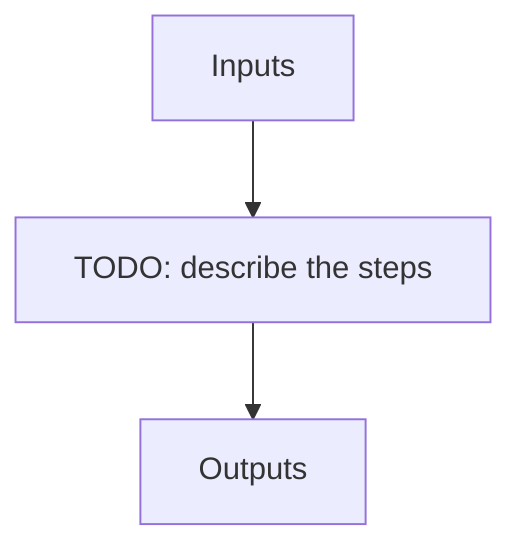

# apero_fit_tellu_nirps_he

**Short name:** FTELLU  **Type:** recipe  **Kind:** tellu  **Instrument:** NIRPS_HE

Telluric recipe to correct science spectra using transmission maps and pca fit.

## Flow

<!-- Replace the diagram below with the real steps. -->



## Usage

```bash
apero_fit_tellu_nirps_he.py {obs_dir}[STRING] [FILE:EXT_E2DS_FF] {options}
```

## Positional arguments

| Argument | Description |
| --- | --- |
| `{obs_dir}[STRING]` | [STRING] The directory to find the data files in. Most of the time this is organised by nightly observation directory |
| `[FILE:EXT_E2DS_FF]` | [STRING/STRINGS] A list of fits files to use separated by spaces. Currently  allowed types: E2DS, E2DSFF |

## Optional arguments

| Argument | Description |
| --- | --- |
| `--use_template[True/False]` | Whether to use the template provided from the telluric database |
| `--template[FILE:TELLU_TEMP]` | Filename of the custom template to use (instead of from telluric database) |
| `--finiteres[True/False]` | Whether to do the finite resolution correction (Always false if no template) |
| `--onlypreclean` | Only run the precleaning steps (not recommended - for debugging ONLY) |
| `--database[True/False]` | [BOOLEAN] Whether to add outputs to calibration/telluric databases |
| `--blazefile[FILE:FF_BLAZE]` | [STRING] Define a custom file to use for blaze correction. If unset uses closest file from calibDB. Checks for an absolute path and then checks 'directory' (CALIBDB=BADPIX) |
| `--plot[0>INT>4]` | [INTEGER] Plot level. 0 = off, 1=save plots only, 2=interactive plots, 3=interactive with loop, 4=advanced mode |
| `--wavefile[FILE:WAVESOL_REF,WAVE_NIGHT,WAVESOL_DEFAULT]` | [STRING] Define a custom file to use for the wave solution. If unset uses closest file from header or calibDB (depending on setup). Checks for an absolute path and then checks 'directory' |
| `--no_in_qc` | Disable checking the quality control of input files |

## Special arguments

<details>
<summary>Arguments common to all APERO recipes</summary>

| Argument | Description |
| --- | --- |
| `--xhelp[STRING]` | Extended help menu (with all advanced arguments) |
| `--debug[STRING]` | Activates debug mode (Advanced mode [INTEGER] value must be an integer greater than 0, setting the debug level) |
| `--list_night[STRING]` | Lists the night name directories in the input directory if used without a 'directory' argument or lists the files in the given 'directory' (if defined). Only lists up to 15 files/directories |
| `--list_all[STRING]` | Lists ALL the night name directories in the input directory if used without a 'directory' argument or lists the files in the given 'directory' (if defined) |
| `--version[STRING]` | Displays the current version of this recipe. |
| `--info[STRING]` | Displays the short version of the help menu |
| `--program[STRING]` | [STRING] The name of the program to display and use (mostly for logging purpose) log becomes date \| {THIS STRING} \| Message |
| `--recipe_kind[STRING]` | [STRING] The recipe kind for this recipe run (normally only used in apero_processing.py) |
| `--parallel[STRING]` | [BOOL] If True this is a run in parellel - disable some features (normally only used in apero_processing.py) |
| `--shortname[STRING]` | [STRING] Set a shortname for a recipe to distinguish it from other runs - this is mainly for use with apero processing but will appear in the log database |
| `--idebug[STRING]` | [BOOLEAN] If True always returns to ipython (or python) at end (via ipdb or pdb) |
| `--ref[STRING]` | If set then recipe is a reference recipe (e.g. reference recipes write to calibration database as reference calibrations) |
| `--crunfile[STRING]` | Set a run file to override default arguments |
| `--quiet[STRING]` | Run recipe without start up text |
| `--nosave` | Do not save any outputs (debug/information run). Note some recipes require other recipesto be run. Only use --nosave after previous recipe runs have been run successfully at least once. |
| `--force_indir[STRING]` | [STRING] Force the default input directory (Normally set by recipe) |
| `--force_outdir[STRING]` | [STRING] Force the default output directory (Normally set by recipe) |

</details>

## Outputs

**Output directory:** `PATH.RED // Default: "red" directory`

| name | description | HDR[DRSOUTID] | file type | suffix | basename | fibers | dbname | dbkey | input file |
| --- | --- | --- | --- | --- | --- | --- | --- | --- | --- |
| ABSO_NPY | Telluric absorption temporary file 1 | -- | .npy | -- | tellu_save.npy | -- | -- | -- | -- |
| ABSO1_NPY | Telluric absorption temporary file 2 | -- | .npy | -- | tellu_save1.npy | -- | -- | -- | -- |
| TELLU_OBJ | Telluric corrected extracted 2D spectrum | TELLU_OBJ | .fits | _e2dsff_tcorr | -- | A | telluric | TELLU_OBJ | EXT_E2DS_FF |
| SC1D_W_FILE | Telluric corrected extracted 1D spectrum (constant wavelength binning) | SC1D_W_FILE | .fits | _s1d_w_tcorr | -- | A | -- | -- | EXT_E2DS_FF |
| SC1D_V_FILE | Telluric corrected extracted 1D spectrum (constant velocity binning) | SC1D_V_FILE | .fits | _s1d_v_tcorr | -- | A | -- | -- | EXT_E2DS_FF |
| TELLU_RECON | Telluric reconstructed 2D absorption file | TELLU_RECON | .fits | _e2dsff_recon | -- | A | telluric | TELLU_RECON | EXT_E2DS_FF |
| RC1D_W_FILE | Telluric reconstructed 1D absorption file (constant wavelength binning) | RC1D_W_FILE | .fits | _s1d_w_recon | -- | A | -- | -- | EXT_E2DS_FF |
| RC1D_V_FILE | Telluric reconstructed 1D absorption file (constant velocity binning) | RC1D_V_FILE | .fits | _s1d_v_recon | -- | A | -- | -- | EXT_E2DS_FF |
| TELLU_SCLEAN | Sky-cleaning file | TELLU_SCLEAN | .fits | _tellu_sclean | -- | A | -- | -- | EXT_E2DS_FF |
| TELLU_PCLEAN | Telluric pre-cleaning file | TELLU_PCLEAN | .fits | _tellu_pclean | -- | A | telluric | TELLU_PCLEAN | EXT_E2DS_FF |

## Plots

**Debug plots:**
`TELLU_SKY_CORR_PLOT`, `EXTRACT_S1D`, `EXTRACT_S1D_WEIGHT`, `FTELLU_PCA_COMP1`, `FTELLU_PCA_COMP2`, `FTELLU_RECON_SPLINE1`, `FTELLU_RECON_SPLINE2`, `FTELLU_WAVE_SHIFT1`, `FTELLU_WAVE_SHIFT2`, `FTELLU_RECON_ABSO1`, `FTELLU_RECON_ABSO2`, `TELLUP_MEAN_RES`, `TELLUP_ABSO_SPEC`, `TELLUP_CLEAN_OH`, `FTELLU_RES_MODEL`, `TELLU_FINITE_RES_CORR`

**Summary plots:**
`SUM_EXTRACT_S1D`, `SUM_FTELLU_RECON_ABSO`, `SUM_TELLUP_MEAN_RES`, `SUM_TELLUP_ABSO_SPEC`, `SUM_FTELLU_RES_MODEL`
