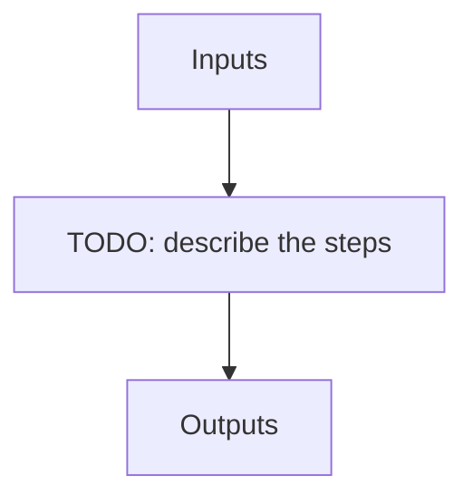

# apero_shape_ref_nirps_he

**Short name:** SHAPEREF  **Type:** recipe  **Kind:** calib-reference  **Instrument:** NIRPS_HE

Shape finding recipe for NIRPS HE

## Flow

<!-- Replace the diagram below with the real steps. -->



## Usage

```bash
apero_shape_ref_nirps_he.py {obs_dir}[STRING] --fpfiles[FILE:FP_FP] {options}
```

## Positional arguments

| Argument | Description |
| --- | --- |
| `{obs_dir}[STRING]` | [STRING] The directory to find the data files in. Most of the time this is organised by nightly observation directory |
| `--fpfiles[FILE:FP_FP]` | Current allowed types: FP_FP |

## Optional arguments

| Argument | Description |
| --- | --- |
| `--database[True/False]` | [BOOLEAN] Whether to add outputs to calibration/telluric databases |
| `--badpixfile[FILE:BADPIX]` | [STRING] Define a custom file to use for bad pixel correction. Checks for an absolute path and then checks 'directory' |
| `--badcorr[True/False]` | [BOOLEAN] Whether to correct for the bad pixel file |
| `--backsub[True/False]` | [BOOLEAN] Whether to do background subtraction |
| `--combine[True/False]` | [BOOLEAN] Whether to combine fits files in file list or to process them separately |
| `--darkfile[FILE:DARKREF]` | [STRING] The Dark file to use (CALIBDB=DARKM) |
| `--darkcorr[True/False]` | [BOOLEAN] Whether to correct for the dark file |
| `--flipimage[True/False]` | [BOOLEAN] Whether to flip fits image |
| `--fluxunits[ADU/s,e-]` | [STRING] Output units for flux |
| `--locofile[FILE:LOC_LOCO]` | [STRING] Sets the LOCO file used to get the coefficients (CALIBDB=LOC_{fiber}) |
| `--plot[0>INT>4]` | [INTEGER] Plot level. 0 = off, 1=save plots only, 2=interactive plots, 3=interactive with loop, 4=advanced mode |
| `--resize[True/False]` | [BOOLEAN] Whether to resize image |
| `--no_in_qc` | Disable checking the quality control of input files |
| `--fpref[FILE:REF_FP]` | [STRING] Sets the FP reference file to use (CALIBDB = FPREF) |

## Special arguments

<details>
<summary>Arguments common to all APERO recipes</summary>

| Argument | Description |
| --- | --- |
| `--xhelp[STRING]` | Extended help menu (with all advanced arguments) |
| `--debug[STRING]` | Activates debug mode (Advanced mode [INTEGER] value must be an integer greater than 0, setting the debug level) |
| `--list_night[STRING]` | Lists the night name directories in the input directory if used without a 'directory' argument or lists the files in the given 'directory' (if defined). Only lists up to 15 files/directories |
| `--list_all[STRING]` | Lists ALL the night name directories in the input directory if used without a 'directory' argument or lists the files in the given 'directory' (if defined) |
| `--version[STRING]` | Displays the current version of this recipe. |
| `--info[STRING]` | Displays the short version of the help menu |
| `--program[STRING]` | [STRING] The name of the program to display and use (mostly for logging purpose) log becomes date \| {THIS STRING} \| Message |
| `--recipe_kind[STRING]` | [STRING] The recipe kind for this recipe run (normally only used in apero_processing.py) |
| `--parallel[STRING]` | [BOOL] If True this is a run in parellel - disable some features (normally only used in apero_processing.py) |
| `--shortname[STRING]` | [STRING] Set a shortname for a recipe to distinguish it from other runs - this is mainly for use with apero processing but will appear in the log database |
| `--idebug[STRING]` | [BOOLEAN] If True always returns to ipython (or python) at end (via ipdb or pdb) |
| `--ref[STRING]` | If set then recipe is a reference recipe (e.g. reference recipes write to calibration database as reference calibrations) |
| `--crunfile[STRING]` | Set a run file to override default arguments |
| `--quiet[STRING]` | Run recipe without start up text |
| `--nosave` | Do not save any outputs (debug/information run). Note some recipes require other recipesto be run. Only use --nosave after previous recipe runs have been run successfully at least once. |
| `--force_indir[STRING]` | [STRING] Force the default input directory (Normally set by recipe) |
| `--force_outdir[STRING]` | [STRING] Force the default output directory (Normally set by recipe) |

</details>

## Outputs

**Output directory:** `PATH.RED // Default: "red" directory`

| name | description | HDR[DRSOUTID] | file type | suffix | dbname | dbkey | input file |
| --- | --- | --- | --- | --- | --- | --- | --- |
| REF_FP | Reference shape master FP calibration file | REF_FP | .fits | _fpref | calibration | FPREF | FP_FP |
| SHAPE_X | Reference shape dx calibration file | SHAPE_X | .fits | _shapex | calibration | SHAPEX | FP_FP |
| SHAPE_Y | Reference shape dy calibration file | SHAPE_Y | .fits | _shapey | calibration | SHAPEY | FP_FP |
| SHAPE_IN_FP | Input FP file for shape comparison | SHAPE_IN_FP | .fits | _shape_in_fp | -- | -- | FP_FP |
| SHAPE_OUT_FP | Output FP file for shape comparison | SHAPE_OUT_FP | .fits | _shape_out_fp | -- | -- | FP_FP |
| SHAPE_BDX | Shape transformed dx comparison file | SHAPE_BDX | .fits | _shape_out_bdx | -- | -- | FP_FP |
| DEBUG_BACK | Individual file background map | DEBUG_BACK | .fits | _background.fits | -- | -- | DRS_PP |

## Plots

**Debug plots:**
`SHAPE_DX`, `SHAPE_ANGLE_OFFSET_ALL`, `SHAPE_ANGLE_OFFSET`, `SHAPE_LINEAR_TPARAMS`

**Summary plots:**
`SUM_SHAPE_ANGLE_OFFSET`
