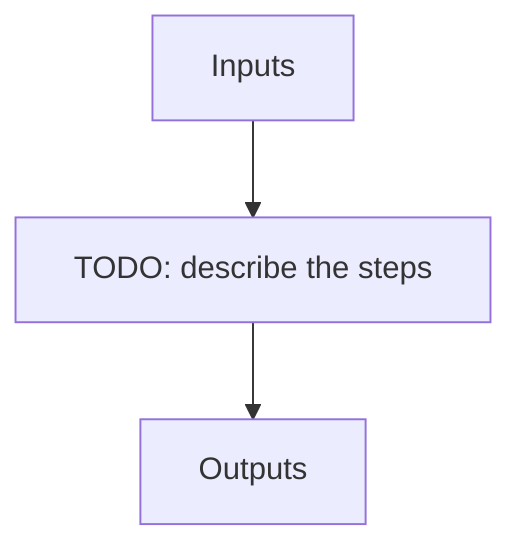

# pp_seq_opt

**Instrument:** NIRPS_HE

!!! warning "Undocumented"

    No description has been written for `pp_seq_opt` yet.

## Flow

<!-- Replace the diagram below with the real steps. -->

## Recipes in this sequence

| ORDER | RECIPE | SHORTNAME | RECIPE KIND | REF RECIPE | FILTERS | ARGS |
| --- | --- | --- | --- | --- | --- | --- |
| 1 | apero_pp_ref_nirps_he.py | PPREF | pre-reference | Yes | -- |  |
| 2 | apero_preprocess_nirps_he.py | PP_CAL | pre-cal | No | KW_RAW_DPRCATG: CALIB |  |
| 3 | apero_preprocess_nirps_he.py | PP_SCI | pre-sci | No | KW_OBJNAME: SCIENCE_TARGETS \|br\| KW_DPRTYPE: OBJ_DARK, OBJ_FP, OBJ_SKY, OBJ_TUN, FLUXSTD_SKY, TELLU_SKY |  |
| 4 | apero_preprocess_nirps_he.py | PP_TEL | pre-tel | No | KW_OBJNAME: TELLURIC_TARGETS |  |
| 5 | apero_preprocess_nirps_he.py | PP_HC1HC1 | pre-hc1hc1 | No | -- | {files}=[RAW_HCONE_HCONE] |
| 6 | apero_extract_nirps_he.py | PP_HC2HC2 | pre-hc2hc2 | No | -- | {files}=[RAW_HCTWO_HCTWO] |
| 7 | apero_preprocess_nirps_he.py | PP_FPFP | pre-fpfp | No | -- | {files}=[RAW_FP_FP] |
| 8 | apero_preprocess_nirps_he.py | PP_FF | pre-ff | No | -- | {files}=[RAW_FLAT_FLAT] |
| 9 | apero_preprocess_nirps_he.py | PP_DFP | pre-dfp | No | -- | {files}=[RAW_DARK_FP] |
| 10 | apero_preprocess_nirps_he.py | PP_FPD | pre-fpd | No | -- | {files}=[RAW_FP_DARK] |
| 11 | apero_preprocess_nirps_he.py | PP_SKY | pre-sky | No | -- | {files}=[RAW_EFF_SKY_SKY, RAW_TEST_EFF_SKY_SKY, RAW_NIGHT_SKY_SKY, RAW_TEST_NIGHT_SKY_SKY] |
| 12 | apero_preprocess_nirps_he.py | PP_LFC | pre-lfc | No | -- | {files}=[RAW_LFC_LFC] |
| 13 | apero_preprocess_nirps_he.py | PP_LFCFP | pre-lfcfp | No | -- | {files}=[RAW_LFC_FP] |
| 14 | apero_preprocess_nirps_he.py | PP_FPLFC | pre-fplfc | No | -- | {files}=[RAW_FP_LFC] |
| 15 | apero_preprocess_nirps_he.py | PP_FPHC1 | pre-fphc1 | No | -- | {files}=[RAW_FP_HCONE] |
| 16 | apero_preprocess_nirps_he.py | PP_HC1FP | pre-hc1fp | No | -- | {files}=[RAW_HCONE_FP] |
| 17 | apero_preprocess_nirps_he.py | PP_EVERY | pre | No | -- | {files}=[DRS_RAW] |
