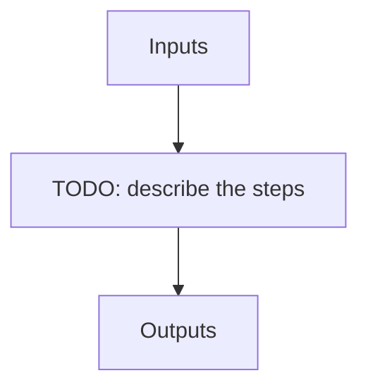

# ref_seq

**Instrument:** NIRPS_HE

!!! warning "Undocumented"

    No description has been written for `ref_seq` yet.

## Flow

<!-- Replace the diagram below with the real steps. -->

## Recipes in this sequence

| ORDER | RECIPE | SHORTNAME | RECIPE KIND | REF RECIPE | ARGS | KWARGS |
| --- | --- | --- | --- | --- | --- | --- |
| 1 | apero_dark_ref_nirps_he.py | DARKREF | calib-reference | Yes |  |  |
| 2 | apero_badpix_nirps_he.py | BADREF | calib-reference | Yes |  |  |
| 3 | apero_loc_nirps_he.py | LOCREF | calib-reference | Yes | {files}=[DARK_FLAT, CALIB_DARK_FLAT, FLAT_DARK, CALIB_FLAT_DARK] |  |
| 4 | apero_shape_ref_nirps_he.py | SHAPEREF | calib-reference | Yes |  |  |
| 5 | apero_shape_nirps_he.py | SHAPELREF | calib-reference | Yes |  |  |
| 6 | apero_flat_nirps_he.py | FLATREF | calib-reference | Yes |  |  |
| 7 | apero_leak_ref_nirps_he.py | LEAKREF | calib-reference | Yes |  |  |
| 8 | apero_wave_ref_nirps_he.py | WAVEREF | calib-reference | Yes |  | --hcfiles=[HCONE_HCONE] \|br\| --fpfiles=[FP_FP] |
