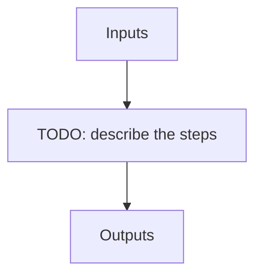

# apero_ari

**Short name:** ARI  **Type:** nolog-tool  **Kind:** user  **Instrument:** default

Run the ARI (APERO reduction interface)

## Flow

<!-- Replace the diagram below with the real steps. -->



## Usage

```bash
apero_ari.py {profile}[STRING] {options}
```

## Positional arguments

| Argument | Description |
| --- | --- |
| `{profile}[STRING]` | ARI yaml file to use |

## Optional arguments

| Argument | Description |
| --- | --- |
| `--obsdir[STRING]` | [STRING] The directory to find the data files in. Most of the time this is organised by nightly observation directory |
| `--reset` | Reset ARI |
| `--redo_objs[STRING]` | List of comma separated objects (named as in astrometric database) to redo. All others will be taken from storage unless not currently processed. |
| `--finder_create` | Overwrites the profile setting to create finder charts |
| `--finder_reset` | Overwrites the profile setting to reset finder charts |
| `--profiles` | List allowed profiles (and path to profiles), as profile is usually required any invalid profile yaml also displays this and exits. |
| `--cores[INT]` | Number of cores to use (default is 0, which uses value from yaml file) |
| `--filterobjs[STRING]` | Only process these objects (should only be used for debugging). List of comma separated objects (named as in astrometric database) |

## Special arguments

<details>
<summary>Arguments common to all APERO recipes</summary>

| Argument | Description |
| --- | --- |
| `--xhelp[STRING]` | Extended help menu (with all advanced arguments) |
| `--debug[STRING]` | Activates debug mode (Advanced mode [INTEGER] value must be an integer greater than 0, setting the debug level) |
| `--list_night[STRING]` | Lists the night name directories in the input directory if used without a 'directory' argument or lists the files in the given 'directory' (if defined). Only lists up to 15 files/directories |
| `--list_all[STRING]` | Lists ALL the night name directories in the input directory if used without a 'directory' argument or lists the files in the given 'directory' (if defined) |
| `--version[STRING]` | Displays the current version of this recipe. |
| `--info[STRING]` | Displays the short version of the help menu |
| `--program[STRING]` | [STRING] The name of the program to display and use (mostly for logging purpose) log becomes date \| {THIS STRING} \| Message |
| `--recipe_kind[STRING]` | [STRING] The recipe kind for this recipe run (normally only used in apero_processing.py) |
| `--parallel[STRING]` | [BOOL] If True this is a run in parellel - disable some features (normally only used in apero_processing.py) |
| `--shortname[STRING]` | [STRING] Set a shortname for a recipe to distinguish it from other runs - this is mainly for use with apero processing but will appear in the log database |
| `--idebug[STRING]` | [BOOLEAN] If True always returns to ipython (or python) at end (via ipdb or pdb) |
| `--ref[STRING]` | If set then recipe is a reference recipe (e.g. reference recipes write to calibration database as reference calibrations) |
| `--crunfile[STRING]` | Set a run file to override default arguments |
| `--quiet[STRING]` | Run recipe without start up text |
| `--nosave` | Do not save any outputs (debug/information run). Note some recipes require other recipesto be run. Only use --nosave after previous recipe runs have been run successfully at least once. |
| `--force_indir[STRING]` | [STRING] Force the default input directory (Normally set by recipe) |
| `--force_outdir[STRING]` | [STRING] Force the default output directory (Normally set by recipe) |

</details>

## Outputs

**Output directory:** `PATH.RED // Default: "red" directory`

This recipe produces no registered output files.
