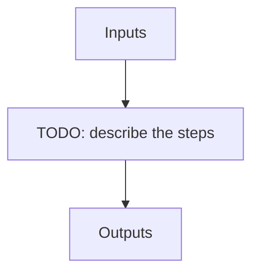

# apero_get

**Short name:** GET  **Type:** nolog-tool  **Kind:** user  **Instrument:** default

Use database to search and copy any files quickly

## Flow

<!-- Replace the diagram below with the real steps. -->



## Usage

```bash
apero_get.py {options}
```

## Optional arguments

| Argument | Description |
| --- | --- |
| `--assets` | Download the assets to the github directory |
| `--gui` | Use a gui to filter files (Currently not ready) |
| `--dbkind[findex,calib,tellu]` |  |
| `--outpath[STRING]` | This is the directory where copied files will be placed. Must be a valid path and must have permission be able to write. |
| `--symlinks` | Create symlinks to the file instead of copying |
| `--tar` | Whether to create a tar instead of copying files.Must also provide the --tarfile argument |
| `--tarfile[STRING]` | The name of the tar file to create. Must also provide the --tar argument |
| `--cores[INT>1]` | How many cores to use for certain steps (will multiprocess when possible) |
| `--objnames[STRING]` | The object names separated by a comma. Use '' for objects with whitespaces i.e 'obj1,obj2,obj 3' |
| `--dprtypes[STRING]` | The DPRTYPES to use (multiple dprtypes combined with OR logic) separate dprtypes with commas. Leaving blank will not use DPRTYPE to filter files. |
| `--outtypes[STRING]` | The drs output file types to use (multiple output type combined  with OR logic) separate output types with commas. Leaving blank will not use output type to filter files. |
| `--fibers[STRING]` | The fibres to use (multiple output type combined  with OR logic) separate fibers with commas. Leaving blank will not use fiber to filter files. |
| `--block_kind[STRING]` | The APERO file block this file belongs to e.g. raw, tmp, red, out, lbl |
| `--keynames[STRING]` | For dbkind=calib or dbkind=tellu this is required, and sets the type of calibration/telluric required (used instead of --outtypes) |
| `--since[STRING]` | Only get files processed since a certain date YYYY-MM-DD hh:mm:ss |
| `--latest[STRING]` | Only get files processed since a certain date YYYY-MM-DD hh:mm:ss |
| `--timekey[processed,observed]` | Whether to use the processed or observed time in the since and latest arguments (applies to both) |
| `--obsdir[STRING]` | Only get files from a certain observation directory |
| `--pi_name[STRING]` | Only get files from a certain PI |
| `--runid[STRING]` | Only get files from certain run ids |
| `--out_prefix[STRING]` | All output files have this prefix added |
| `--out_suffix[STRING]` | All output files have this suffix added |
| `--permission_yaml[STRING]` | Sort files based on permissions in this yaml file. Must also define --group_yaml. |
| `--group_yaml[STRING]` | Group yaml file. For use with --permission_yaml. |
| `--group_server[STRING]` | Group server to use with --group_yaml and --permission_yaml. |
| `--failedqc` | Include files that failed QC. Highly unrecommended. |
| `--nosubdir` | Do not put files into a sub-directory. Only use thes outpath |
| `--test` | Does not copy files - prints copy as a debug test. Recommended for first time use. |
| `--sizelimit[INT]` | Limit the size of output tarfile (in GB) |
| `--nodb` | Use filesystem to search for files [very slow] usually just for debugging |
| `--nodb_wildcard[STRING]` | When --nodb is used use --nodb_wildcard to only target specific files |
| `--mp_mode[STRING]` | The multiprocessing mode to use when using --cores |

## Special arguments

<details>
<summary>Arguments common to all APERO recipes</summary>

| Argument | Description |
| --- | --- |
| `--xhelp[STRING]` | Extended help menu (with all advanced arguments) |
| `--debug[STRING]` | Activates debug mode (Advanced mode [INTEGER] value must be an integer greater than 0, setting the debug level) |
| `--list_night[STRING]` | Lists the night name directories in the input directory if used without a 'directory' argument or lists the files in the given 'directory' (if defined). Only lists up to 15 files/directories |
| `--list_all[STRING]` | Lists ALL the night name directories in the input directory if used without a 'directory' argument or lists the files in the given 'directory' (if defined) |
| `--version[STRING]` | Displays the current version of this recipe. |
| `--info[STRING]` | Displays the short version of the help menu |
| `--program[STRING]` | [STRING] The name of the program to display and use (mostly for logging purpose) log becomes date \| {THIS STRING} \| Message |
| `--recipe_kind[STRING]` | [STRING] The recipe kind for this recipe run (normally only used in apero_processing.py) |
| `--parallel[STRING]` | [BOOL] If True this is a run in parellel - disable some features (normally only used in apero_processing.py) |
| `--shortname[STRING]` | [STRING] Set a shortname for a recipe to distinguish it from other runs - this is mainly for use with apero processing but will appear in the log database |
| `--idebug[STRING]` | [BOOLEAN] If True always returns to ipython (or python) at end (via ipdb or pdb) |
| `--ref[STRING]` | If set then recipe is a reference recipe (e.g. reference recipes write to calibration database as reference calibrations) |
| `--crunfile[STRING]` | Set a run file to override default arguments |
| `--quiet[STRING]` | Run recipe without start up text |
| `--nosave` | Do not save any outputs (debug/information run). Note some recipes require other recipesto be run. Only use --nosave after previous recipe runs have been run successfully at least once. |
| `--force_indir[STRING]` | [STRING] Force the default input directory (Normally set by recipe) |
| `--force_outdir[STRING]` | [STRING] Force the default output directory (Normally set by recipe) |

</details>

## Outputs

**Output directory:** `PATH.RED // Default: "red" directory`

This recipe produces no registered output files.
