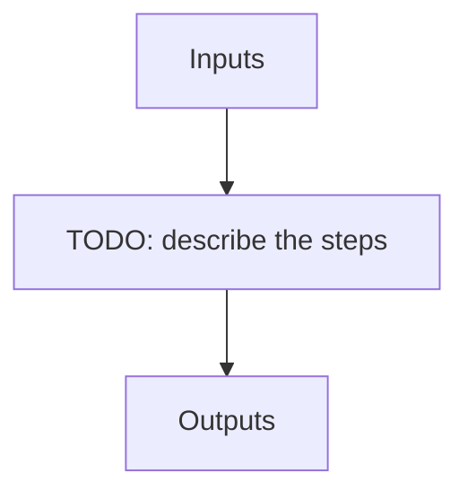

# apero_processing

**Short name:** PROC  **Type:** tool  **Kind:** processing  **Instrument:** default

Process a night or a set of nights or all nights given some options and a run file

## Flow

<!-- Replace the diagram below with the real steps. -->



## Usage

```bash
apero_processing.py {runfile}[STRING] {options}
```

## Positional arguments

| Argument | Description |
| --- | --- |
| `{runfile}[STRING]` | [STRING] The run file to use in reprocessing |

## Optional arguments

| Argument | Description |
| --- | --- |
| `--obs_dir[STRING]` | PROCESS_OBS_DIR_HELP |
| `--filename[STRING]` | [STRING] The 'filename' to reprocess (default is None for all files) |
| `--exclude_obs_dirs[STRING]` | PROCESS_EXCLUDE_OBS_DIRS_HELP |
| `--include_obs_dirs[STRING]` | PROCESS_INCLUDE_OBS_DIRS_HELP |
| `--cores[STRING]` | [INTEGER] Number of cores to use in processing |
| `--test[True,False,1,0,None]` | [BOOLEAN] If True does not process any files just prints an output of what recipes would be run |
| `--trigger` | [BOOLEAN] If True activates trigger mode (i.e. will stop processing at the first point we do not find required files). Note one must define --night in trigger mode |
| `--science_targets[STRING]` | [STRING] A list of object names to process as science targets (if unsets default to the run.in file) must be separated by a comma and surrounded with speech-marks i.e. 'target1,target2,target3' |
| `--telluric_targets[STRING]` | [STRING] A list of object names to process as telluric targets (if unsets default to the run.in file) must be separated by a commas and surrounded with speech-marks i.e. 'target1,target2,target3' |
| `--update_objdb` | Update the object database - only recommended if doing a full reprocess with all data. |
| `--to_file[STRING]` | [STRING] Output recipes to run to text file (sets --test=True) |
| `--verify` | [SWITCH] Verify input run file (but do not run) |
| `--queue_mode[True,False,1,0,None]` | Whether to run in queue mode (jobs are added to the queue instead of being processed directly). Overrides QUEUE_MODE from the run file and the QUEUE.MODE constant. |

## Special arguments

<details>
<summary>Arguments common to all APERO recipes</summary>

| Argument | Description |
| --- | --- |
| `--xhelp[STRING]` | Extended help menu (with all advanced arguments) |
| `--debug[STRING]` | Activates debug mode (Advanced mode [INTEGER] value must be an integer greater than 0, setting the debug level) |
| `--list_night[STRING]` | Lists the night name directories in the input directory if used without a 'directory' argument or lists the files in the given 'directory' (if defined). Only lists up to 15 files/directories |
| `--list_all[STRING]` | Lists ALL the night name directories in the input directory if used without a 'directory' argument or lists the files in the given 'directory' (if defined) |
| `--version[STRING]` | Displays the current version of this recipe. |
| `--info[STRING]` | Displays the short version of the help menu |
| `--program[STRING]` | [STRING] The name of the program to display and use (mostly for logging purpose) log becomes date \| {THIS STRING} \| Message |
| `--recipe_kind[STRING]` | [STRING] The recipe kind for this recipe run (normally only used in apero_processing.py) |
| `--parallel[STRING]` | [BOOL] If True this is a run in parellel - disable some features (normally only used in apero_processing.py) |
| `--shortname[STRING]` | [STRING] Set a shortname for a recipe to distinguish it from other runs - this is mainly for use with apero processing but will appear in the log database |
| `--idebug[STRING]` | [BOOLEAN] If True always returns to ipython (or python) at end (via ipdb or pdb) |
| `--ref[STRING]` | If set then recipe is a reference recipe (e.g. reference recipes write to calibration database as reference calibrations) |
| `--crunfile[STRING]` | Set a run file to override default arguments |
| `--quiet[STRING]` | Run recipe without start up text |
| `--nosave` | Do not save any outputs (debug/information run). Note some recipes require other recipesto be run. Only use --nosave after previous recipe runs have been run successfully at least once. |
| `--force_indir[STRING]` | [STRING] Force the default input directory (Normally set by recipe) |
| `--force_outdir[STRING]` | [STRING] Force the default output directory (Normally set by recipe) |

</details>

## Outputs

**Output directory:** `PATH.RED // Default: "red" directory`

This recipe produces no registered output files.
