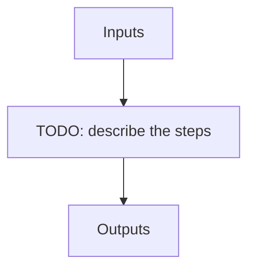

# apero_queue

**Short name:** QUEUE  **Type:** nolog-tool  **Kind:** processing  **Instrument:** default

The APERO queue management tool - run, batch, monitor and reset the processing queue (created by apero_processing in queue mode)

## Flow

<!-- Replace the diagram below with the real steps. -->



## Usage

```bash
apero_queue.py {mode}[STRING] {options}
```

## Positional arguments

| Argument | Description |
| --- | --- |
| `{mode}[STRING]` | The queue mode: "run" runs the next task(s) in the queue, "batch" creates (and submits) sbatch scripts for the next group, "status" shows an interactive terminal view of the queue, "gui" starts a browser dashboard (status view + action buttons), "reset" removes entries from the queue, "init" creates the batch template, "action" runs an explicit queue action and "system" (internal) moves a task from running to complete/failed |

## Optional arguments

| Argument | Description |
| --- | --- |
| `--cores[STRING]` | Number of tasks to run at once in run mode (same rules as apero_processing --cores) |
| `--mpmode[process,pool,linear,None]` | The multiprocessing mode for run mode (defaults to the TOOLS.REPROCESS.MP_TYPE constant, same as apero_processing) |
| `--ntasks[STRING]` | Total number of queue tasks to run in run mode. Default is one cycle (up to --cores). Use "all" to keep running until blocked or the queue is empty |
| `--qstate[pending,running,complete,failed,all,None]` | Only act on this queue state (for status and reset modes) - default is all states |
| `--qaction[move_to_pending,move_all_failed_to_pending,move_all_complete_to_pending,stop_all_running,stop_to_pending,stop_to_complete,stop_to_failed,clear_all_pending,None]` | Explicit queue action for action mode. Use --qid for per-run actions |
| `--rows[STRING]` | Number of rows to show per page in status mode (cli pager page size) and gui mode (table page size) |
| `--host[STRING]` | The host address for the gui dashboard server (gui mode only, default 127.0.0.1 i.e. localhost only) |
| `--port[STRING]` | The port for the gui dashboard server (gui mode only, default 8090 - tries the next ports if taken) |
| `--qpath[STRING]` | The absolute path to the queue directory (system mode only - allows the fast path to avoid loading the APERO runtime) |
| `--qid[STRING]` | The queue id of a task, i.e. "{group}/{run_file}" (action mode per-run actions and system mode) |
| `--qresult[success,failed,None]` | The result of a task (system mode only) |
| `--template[STRING]` | The name of the batch template to use (init and batch modes) - default is "default". Use "apero_queue.py init" to create named templates |
| `--per_batch[STRING]` | Number of tasks per batch script (batch mode) - if given, skips the interactive question |
| `--n_batches[STRING]` | Number of batch scripts to create (batch mode) - if given, skips the interactive question |
| `--submit[True,False,None]` | Whether to submit the batch script(s) via sbatch (batch mode) - if given, skips the interactive question |

## Special arguments

<details>
<summary>Arguments common to all APERO recipes</summary>

| Argument | Description |
| --- | --- |
| `--xhelp[STRING]` | Extended help menu (with all advanced arguments) |
| `--debug[STRING]` | Activates debug mode (Advanced mode [INTEGER] value must be an integer greater than 0, setting the debug level) |
| `--list_night[STRING]` | Lists the night name directories in the input directory if used without a 'directory' argument or lists the files in the given 'directory' (if defined). Only lists up to 15 files/directories |
| `--list_all[STRING]` | Lists ALL the night name directories in the input directory if used without a 'directory' argument or lists the files in the given 'directory' (if defined) |
| `--version[STRING]` | Displays the current version of this recipe. |
| `--info[STRING]` | Displays the short version of the help menu |
| `--program[STRING]` | [STRING] The name of the program to display and use (mostly for logging purpose) log becomes date \| {THIS STRING} \| Message |
| `--recipe_kind[STRING]` | [STRING] The recipe kind for this recipe run (normally only used in apero_processing.py) |
| `--parallel[STRING]` | [BOOL] If True this is a run in parellel - disable some features (normally only used in apero_processing.py) |
| `--shortname[STRING]` | [STRING] Set a shortname for a recipe to distinguish it from other runs - this is mainly for use with apero processing but will appear in the log database |
| `--idebug[STRING]` | [BOOLEAN] If True always returns to ipython (or python) at end (via ipdb or pdb) |
| `--ref[STRING]` | If set then recipe is a reference recipe (e.g. reference recipes write to calibration database as reference calibrations) |
| `--crunfile[STRING]` | Set a run file to override default arguments |
| `--quiet[STRING]` | Run recipe without start up text |
| `--nosave` | Do not save any outputs (debug/information run). Note some recipes require other recipesto be run. Only use --nosave after previous recipe runs have been run successfully at least once. |
| `--force_indir[STRING]` | [STRING] Force the default input directory (Normally set by recipe) |
| `--force_outdir[STRING]` | [STRING] Force the default output directory (Normally set by recipe) |

</details>

## Outputs

**Output directory:** `PATH.RED // Default: "red" directory`

This recipe produces no registered output files.
