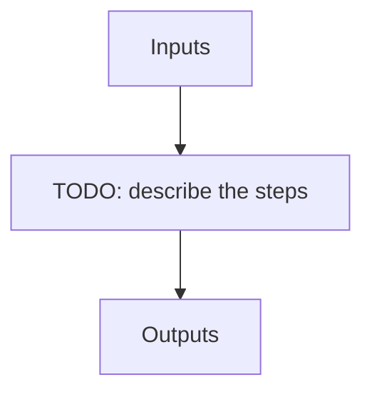

# apero_reject

**Short name:** REJECT  **Type:** nolog-tool  **Kind:** user  **Instrument:** default

Add a object or file to the object or file reject list online.

## Flow

<!-- Replace the diagram below with the real steps. -->



## Usage

```bash
apero_reject.py {options}
```

## Optional arguments

| Argument | Description |
| --- | --- |
| `--identifier[STRING]` | Add a specific file identifier to the file reject list. E.g. for spirou this is the odocode, for nirps this is raw the filename (Can add multiple as comma separated list) |
| `--objname[STRING]` | Add a specific object name to the object reject list (Can add multiple as comma separated list) |
| `--obsdir[STRING]` | Add all files from a certain observation directory to the file reject list (excludes science observations). You may only select one obsdir at once. Note this overrides --identifier |
| `--autofill[STRING]` | Autofill the questions asked. For identifier this is PP,TEL,RV,COMMENT e.g. "1,1,1,bad target" For objname this is ALIASES,BAD_ASTRO,NOTES e.g. "alias1\|alias2\|alias3,0,Not a real target"      or      e.g. "alias1\|alias2\|alias3,1,No proper motion" |
| `--test` | Whether to run in test mode (recommended first time) |

## Special arguments

<details>
<summary>Arguments common to all APERO recipes</summary>

| Argument | Description |
| --- | --- |
| `--xhelp[STRING]` | Extended help menu (with all advanced arguments) |
| `--debug[STRING]` | Activates debug mode (Advanced mode [INTEGER] value must be an integer greater than 0, setting the debug level) |
| `--list_night[STRING]` | Lists the night name directories in the input directory if used without a 'directory' argument or lists the files in the given 'directory' (if defined). Only lists up to 15 files/directories |
| `--list_all[STRING]` | Lists ALL the night name directories in the input directory if used without a 'directory' argument or lists the files in the given 'directory' (if defined) |
| `--version[STRING]` | Displays the current version of this recipe. |
| `--info[STRING]` | Displays the short version of the help menu |
| `--program[STRING]` | [STRING] The name of the program to display and use (mostly for logging purpose) log becomes date \| {THIS STRING} \| Message |
| `--recipe_kind[STRING]` | [STRING] The recipe kind for this recipe run (normally only used in apero_processing.py) |
| `--parallel[STRING]` | [BOOL] If True this is a run in parellel - disable some features (normally only used in apero_processing.py) |
| `--shortname[STRING]` | [STRING] Set a shortname for a recipe to distinguish it from other runs - this is mainly for use with apero processing but will appear in the log database |
| `--idebug[STRING]` | [BOOLEAN] If True always returns to ipython (or python) at end (via ipdb or pdb) |
| `--ref[STRING]` | If set then recipe is a reference recipe (e.g. reference recipes write to calibration database as reference calibrations) |
| `--crunfile[STRING]` | Set a run file to override default arguments |
| `--quiet[STRING]` | Run recipe without start up text |
| `--nosave` | Do not save any outputs (debug/information run). Note some recipes require other recipesto be run. Only use --nosave after previous recipe runs have been run successfully at least once. |
| `--force_indir[STRING]` | [STRING] Force the default input directory (Normally set by recipe) |
| `--force_outdir[STRING]` | [STRING] Force the default output directory (Normally set by recipe) |

</details>

## Outputs

**Output directory:** `PATH.RED // Default: "red" directory`

This recipe produces no registered output files.
