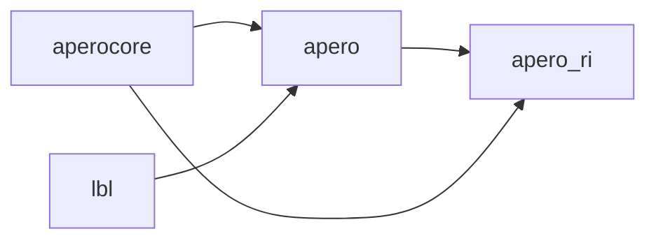
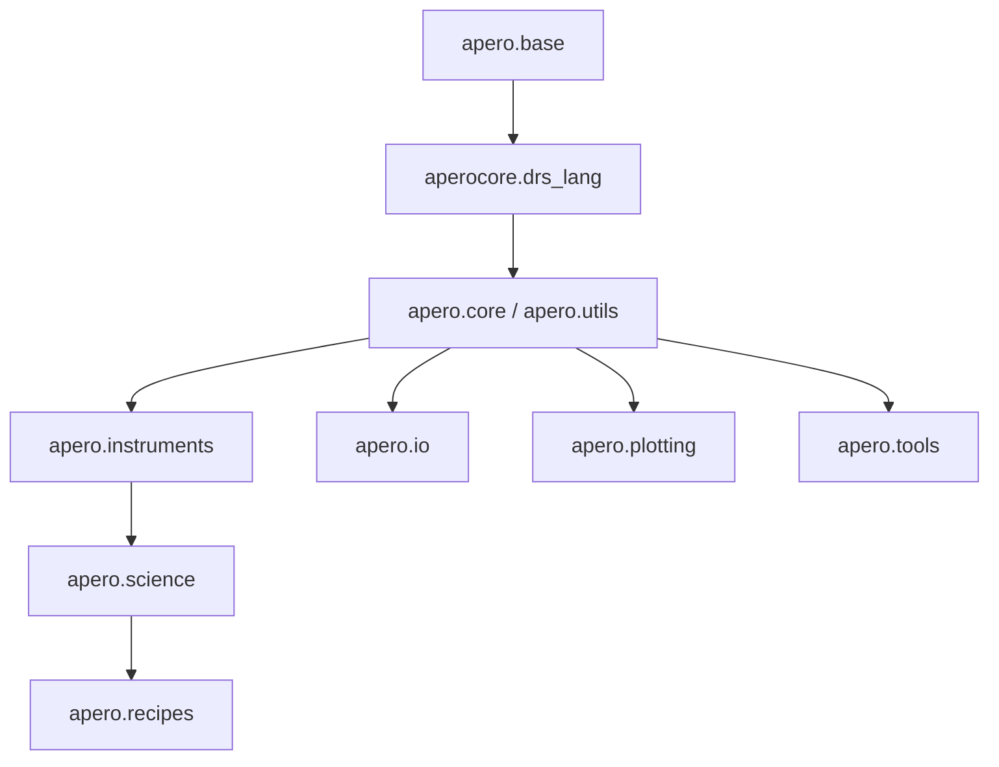

# APERO developer guide (v0.8)

How APERO is put together, and how to change it without breaking anything.

If you only want to *run* APERO, you want the
[APERO reference documentation](/docs/apero) instead.

## Package layout

APERO v0.8 is split into four installable packages in one repository:

| Package | Import name | Purpose |
| --- | --- | --- |
| `apero-core` | `aperocore` | Reusable, DRS-independent functionality: maths, constants machinery, logging, language database, and pure science algorithms. |
| `apero-drs` | `apero` | The data reduction pipeline itself: recipes, instrument definitions, science wrappers, tools. |
| `apero-ri` | `apero_ri` | The Flask reduction interface (this website). |
| `lbl` | `lbl` | Line-by-line radial velocity code (separate repository). |

The dependency direction is strictly one way:

Inside `apero` the layering is:

A module may only import from the layers **below** it. `apero.base` imports
nothing from APERO at all.

## The `_core` rule

Anything in `apero-core/aperocore/science/*_core.py` must be usable by an
external package that has never heard of APERO. That means such functions:

- must **not** take a `ParamDict`, `DrsRecipe`, `DrsFitsFile`, or any other
  apero-drs object;
- must take plain, documented arguments (numpy arrays, floats, ints,
  strings, and tuples/lists of those);
- must not take a fixed-key "bag" dictionary standing in for many named
  arguments. A dictionary *is* fine when it is a genuinely open-ended
  mapping (one entry per fiber, per exposure, per band, ...).

The thin wrapper that unpacks a `ParamDict` and calls the core function
lives next to the higher-level APERO function it supports, for example
`apero/science/calib/localisation.py` wraps
`aperocore.science.calib.localisation_core`.

## How to guides

- [Add a new constant](developer/how_to/add_a_constant)
- [Add a new header keyword](developer/how_to/add_a_keyword)
- [Add a new recipe](developer/how_to/add_a_recipe)
- [Add a new file definition](developer/how_to/add_a_file_definition)
- [Add a new plot](developer/how_to/add_a_plot)
- [Add a new instrument](developer/how_to/add_an_instrument)
- [Write documentation](developer/how_to/write_documentation)
- [Python style and conventions](developer/how_to/python_style)
- [Run the tests](developer/how_to/run_the_tests)
