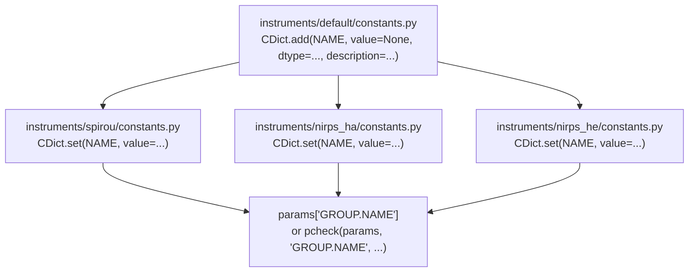

# How to add a new constant

Every APERO constant is declared **once** and then given a value **once per
instrument**. Nothing else is allowed — a constant with no default in
`default/constants.py`, or a constant missing an override for one
instrument, is a bug.



## 1. Declare the constant

In `apero-drs/apero/instruments/default/constants.py`, inside the `cgroup`
section it belongs to:

```python
# =============================================================================
cgroup = 'CAL.BCORR'
# =============================================================================

# Width of the box used to measure the background, in pixels. Read by
# apero.science.calib.background.create_background_map().
CDict.add('BKGR_BOXSIZE', value=None, dtype=int, source=__NAME__,
          group=cgroup,
          description='Width of the box used to measure the background '
                      '(in pixels) - used by create_background_map()')
```

Rules:

- `value=None` here. **No instrument default belongs in this file.**
- `dtype` is one of `int`, `float`, `bool`, `str`, `list`, or `'path'`.
- For a list, also give `dtypei` (the type of each element), e.g.
  `dtype=list, dtypei=float`. `CDict` does not support raw tuples — use a
  plain Python list.
- `description` must say what the constant controls and, where it helps,
  which function or recipe reads it.

## 2. Override it for every instrument

In each of `spirou/constants.py`, `nirps_ha/constants.py` and
`nirps_he/constants.py`, under the matching `cgroup` section:

```python
# =============================================================================
cgroup = 'CAL.BCORR'
# =============================================================================

# Width of the box used to measure the background, in pixels. Read by
# apero.science.calib.background.create_background_map().
CDict.set('BKGR_BOXSIZE', value=64, source=__NAME__, group=cgroup)
```

Note:

- Do **not** repeat `dtype` or `description` — `set` reuses the definition.
- Keep the explanatory comment from the `add(...)` call above every
  `set(...)`. The instrument file should still read as documentation.
- Add the override to **all** instruments even when the value is identical,
  so the constant is never undefined for one of them.

## 3. Read the constant

Directly:

```python
boxsize = params['CAL.BCORR.BKGR_BOXSIZE']
```

Or, in a function that wants to expose the constant as an optional keyword
argument, via `pcheck`:

```python
from aperocore.constants import param_functions
pcheck = param_functions.PCheck(wlog=WLOG)


def create_background_map(params, image, badpixmask, boxsize=None):
    """
    ...
    :param boxsize: int or None, override for CAL.BCORR.BKGR_BOXSIZE
    """
    func_name = __NAME__ + '.create_background_map()'
    # fall back to the params value when the caller gives no override
    boxsize = pcheck(params, 'CAL.BCORR.BKGR_BOXSIZE', 'boxsize',
                     func=func_name, override=boxsize)
```

`no_sub` in `apero/science/calib/background.py::correction` is the
reference implementation of this pattern.

## 4. Check it

```bash
apero_validate.py
```

A missing instrument override raises at startup with
`Constant "GROUP.NAME" not found in storage`.
