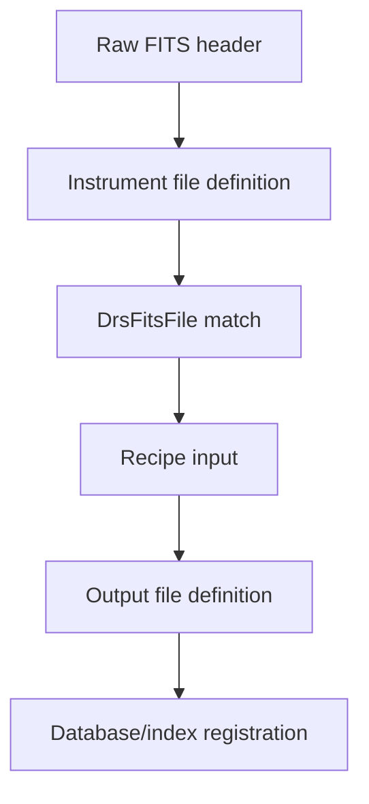

# How to add a file definition

File definitions tell APERO how to recognize inputs, connect processed files
to their source files, represent FITS extensions, and classify outputs.

## 1. Choose the owning instrument

Instrument file definitions live in
`apero-drs/apero/instruments/<instrument>/file_definitions.py`. Shared
generic definitions live in `default/file_definitions.py`. Prefer extending
the existing definition family rather than adding an isolated convention.

## 2. Define the file

Use the local `drs_finput` (or appropriate `drs_ninput` / `drs_oinput`)
constructor. The definition typically specifies:

- stable internal `name` and file type / suffix;
- `outclass` to determine how outputs are written and indexed;
- `intype` for the parent/source file, where relevant;
- `hkeys` for header conditions that identify a raw subtype;
- `description` that tells the reader what the file contains.

Attach instrument-specific raw subtypes to the parent `raw_file` with
`raw_file.addset(...)`. Use internal APERO keyword symbols in `hkeys`, not
literal FITS card names.

## 3. Define FITS extensions where needed

For multi-extension products, add the appropriate `AperoImageModel` or
`AperoTableModel` to the output definition's `hdulist`. Give each extension a
meaningful stable name and model. Check the nearby instrument definition for
fiber-specific and database registration conventions.

## 4. Connect outputs to recipes

In `recipe_definitions.py`, register the output through `set_outputs(...)`.
Recipes should consume the defined file objects rather than constructing
unregistered products ad hoc.

## 5. Describe and validate

Add human-readable context in
`documentation/descriptions/<instrument>/files/<category>.md` if the table
alone is not enough. Regenerate the file definition pages with
`apero_documentation.py --ari --instruments=<instrument>`.

Run the narrow tests and `apero_validate.py`; verify raw header matches and
output extension names against representative files for that instrument.
