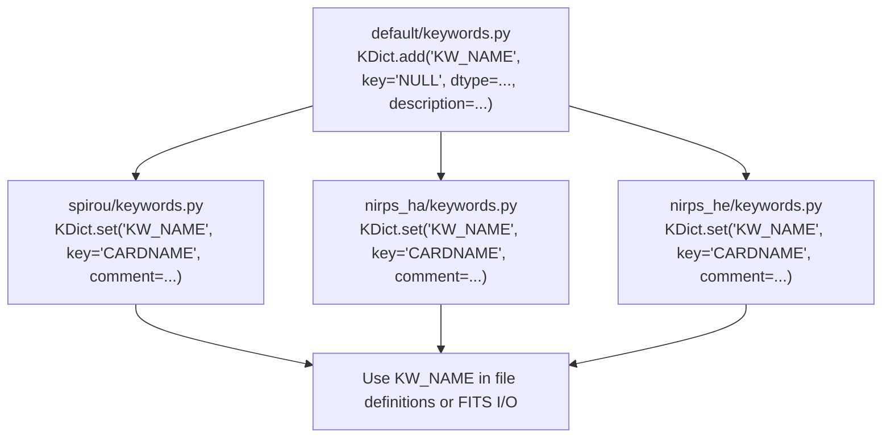

# How to add a FITS keyword

APERO keywords map stable internal names to instrument-specific FITS card
names. Declare each keyword once in the default keyword definitions, then
map it for every supported instrument.



## 1. Declare the internal keyword

In `apero-drs/apero/instruments/default/keywords.py`, add it in the
appropriate `cgroup` section:

```python
cgroup = 'DRS'

KDict.add('KW_EXAMPLE', key='NULL', dtype=str, source=__NAME__,
          description='Records the reduction mode used to create this file.')
```

Use `key='NULL'` in the default definition. Select the data type that matches
the value written to or read from the FITS header, and describe what the
keyword records.

## 2. Map the FITS card for each instrument

In every instrument's `keywords.py`, add a `KDict.set(...)` under the same
group. Preserve the definition comment immediately above each override:

```python
cgroup = 'DRS'

# Records the reduction mode used to create this file.
KDict.set('KW_EXAMPLE', key='DRSMODE', comment='Reduction mode')
```

Do this for SPIROU, NIRPS-HA, and NIRPS-HE, even when card names are the same.
Do not repeat `dtype` or `description` in the instrument overrides.

## 3. Use the internal name

Use the APERO symbol `KW_EXAMPLE` in code and definitions, not the FITS card
string `DRSMODE`. This lets instrument mappings remain the single source of
truth.

## 4. Verify

Run `apero_validate.py` with a profile for each instrument. Check both that
the card is present in the output FITS header and that its value has the
expected type and meaning.
