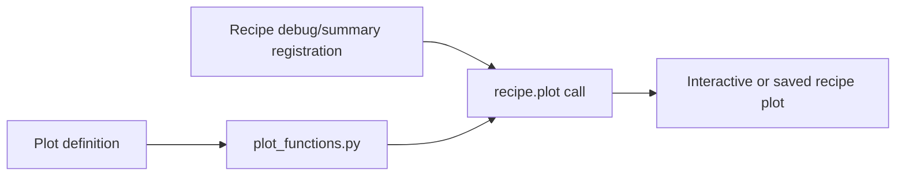

# How to add an APERO plot

APERO plots are registered products of the recipe plotting system, not
standalone matplotlib windows or ad hoc PDF files created from recipe code.



## 1. Register the plot name

Add a unique plot name to
`apero-drs/apero/plotting/definitions.yaml`. Follow the neighboring entry for
its schema, plot type, and any instrument-specific settings.

## 2. Implement the plot

Add the plotting function in
`apero-drs/apero/plotting/plot_functions.py`. Match the standard plotting
function signature and handle the arrays/properties passed by the recipe.
Keep the plot interpretable: label axes, units, and relevant series; handle
masked or invalid data; avoid hiding the diagnostic behind decorative detail.

## 3. Enable it on the recipe

In the owning instrument's `recipe_definitions.py`, register it with
`set_debug_plots(...)` or `set_summary_plots(...)`. Summary plots should be
useful as routine quality/overview output; debug plots may be more detailed.

## 4. Call it from science/recipe code

Call through the standard recipe API, passing arrays and properties by
keyword:

```python
recipe.plot(
    'PLOT_NAME',
    wavelength=wavelength,
    flux=flux,
    properties=plot_properties,
)
```

Keep the recipe body focused on deciding when the plot is produced. Plot
layout and rendering stay in `plot_functions.py`.

## 5. Check it

Run the narrow test or recipe debug path that exercises the plot. Confirm the
plot is registered, renders with the expected axes/units, and does not fail
when optional diagnostic arrays are absent.
