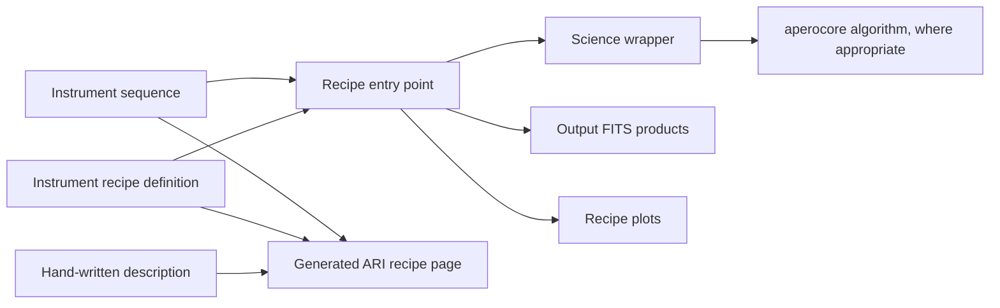

# How to add an APERO recipe

A recipe is a user-visible processing step. Its definition declares the
interface and products; its recipe module orchestrates science functions; its
instrument sequence determines where it runs.



## 1. Define the public recipe

Add the recipe to `apero-drs/apero/instruments/<instrument>/recipe_definitions.py`.
Use `DrsRecipe`, set its name, short name, instrument, input/output blocks,
recipe type and kind, description, outputs, positional arguments and keyword
arguments. Add it to the module's `recipes` list.

Follow the nearest recipe with the same processing role. Shared instrument
patterns belong in `default/recipe_definitions.py` or a shared science module;
avoid maintaining duplicate recipe bodies when the steps are identical.

For the recipe body, keep `__main__` easy to scan: use `# ----` headings for
phases and delegate work to one science function per phase where practical.
For extraction recipes, use the established `extract.main_extract()` setup
rather than repeating the main per-file setup.

## 2. Implement science work at the right layer

Instrument-independent algorithms belong in `apero-core/aperocore/science`
when they can be expressed with plain arrays/scalars. They must not accept
`ParamDict`, `DrsRecipe`, `DrsFitsFile`, or fixed-key bags such as `props`.
Put the thin APERO wrapper that reads parameters and FITS products next to the
higher-level science function it supports.

Recipes should sequence work, not become the only place the algorithm exists.

## 3. Register it in sequences

Add the recipe to the appropriate `DrsRunSequence` definition in the
instrument recipe definitions. Keep instrument sequences structurally
identical when their science steps match; put real instrument differences in
constants or science modules.

## 4. Describe it

Create `documentation/descriptions/<instrument>/recipes/<recipe-name>.md`.
Include the science purpose, important assumptions, inputs and outputs, and a
hand-written Mermaid flow diagram. Add algorithm page slugs and literature
references in the YAML frontmatter when those pages exist:

```yaml
---
algorithms:
  - order_localisation
references:
  - '[Author et al. (Year)](https://doi.org/example)'
---
```

The diagram should expose the science steps and data flow, not startup,
logging, parameter parsing, or other wrapper mechanics. Regenerate with:

```bash
apero_documentation.py --ari --instruments=SPIROU
```

## 5. Add tests and check outputs

Use deterministic tests under `apero-drs/tests` or `apero-core/tests` for the
science behavior. Avoid profile, network, database, and large-data
requirements in unit tests. Inspect the generated recipe page and ensure
inputs, outputs, sequence placement, description, and algorithm links agree.
