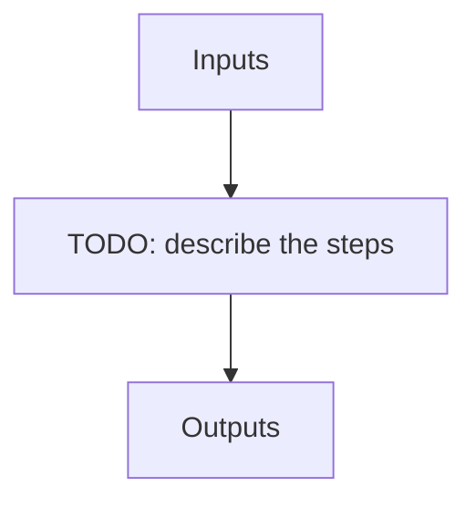

---
# Related algorithm pages (docs refs under apero/algorithms)
algorithms: []
# Literature references rendered at the bottom of the page
references: []
---

Opens a GUI browser to help one navigate the raw, working and reduced directories. Displays all files and a select set of header keys

## Flow

<!-- Replace the diagram below with the real steps. -->

