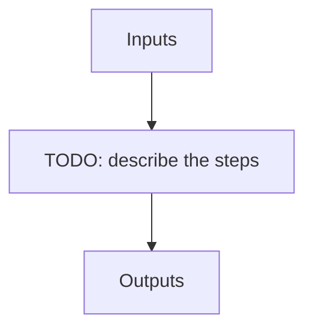

---
# Related algorithm pages (docs refs under apero/algorithms)
algorithms: []
# Literature references rendered at the bottom of the page
references: []
---

PRECHECK_DESCRIPTION

## Flow

<!-- Replace the diagram below with the real steps. -->

