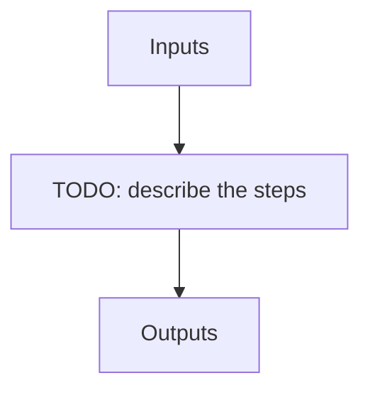

---
# Related algorithm pages (docs refs under apero/algorithms)
algorithms: []
# Literature references rendered at the bottom of the page
references: []
---

Process a night or a set of nights or all nights given some options and a run file

## Flow

<!-- Replace the diagram below with the real steps. -->

