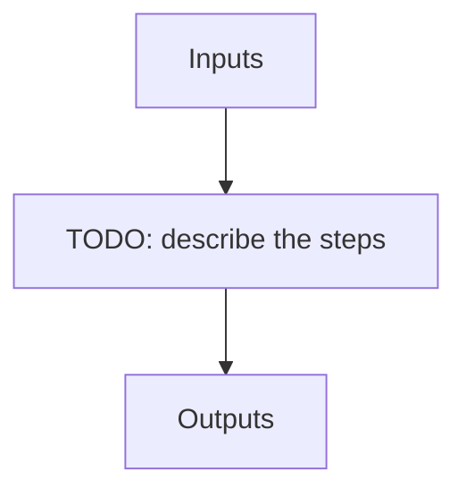

---
# Related algorithm pages (docs refs under apero/algorithms)
algorithms: []
# Literature references rendered at the bottom of the page
references: []
---

The APERO queue management tool - run, batch, monitor and reset the processing queue (created by apero_processing in queue mode)

## Flow

<!-- Replace the diagram below with the real steps. -->

