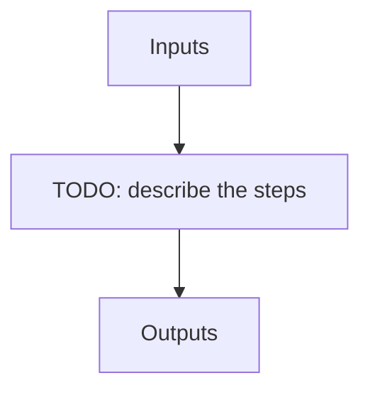

---
# Related algorithm pages (docs refs under algorithms/)
algorithms: []
# Literature references rendered at the bottom of the page
references: []
---

Run the cross-correlation recipe in order to calculate the RV of an object.

## Flow

<!-- Replace the diagram below with the real steps. -->

