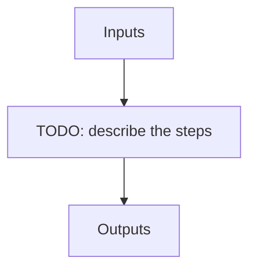

---
# Related algorithm pages (docs refs under algorithms/)
algorithms: []
# Literature references rendered at the bottom of the page
references: []
---

Creates the reference dark_fp used for correcting the leakage from fiber C for extraction products

## Flow

<!-- Replace the diagram below with the real steps. -->

