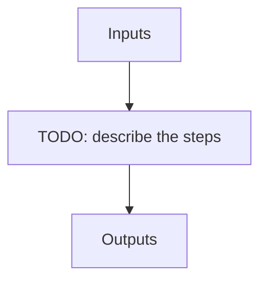

---
# Related algorithm pages (docs refs under algorithms/)
algorithms: []
# Literature references rendered at the bottom of the page
references: []
---

Telluric recipe to create template spectra (median of many observations) of the same object. Used to provide a better SED of stars in obj_mk_tellu and obj_fit_tellu. Note only needs to be run once for each science / hot star target.

## Flow

<!-- Replace the diagram below with the real steps. -->

