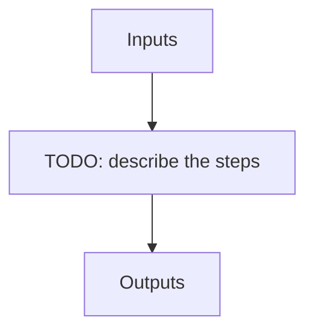

---
# Related algorithm pages (docs refs under algorithms/)
algorithms: []
# Literature references rendered at the bottom of the page
references: []
---

Wavelength solution finding recipe for NIRPS HA.

 Uses HCONE_HCONE to find an initial solution and optionally FP_FP files to find more accurate solution.

## Flow

<!-- Replace the diagram below with the real steps. -->

