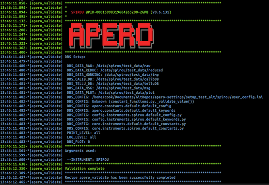

.. _installation:

************************************************************************************
Installation
************************************************************************************

.. only:: html

  Below is the guide for first time installation and upgrade

  * :ref:`installation-prerequisites`
  * :ref:`installation-download`
  * :ref:`installation-setup`
  * :ref:`installation-update`

Once you have installed APERO you can read about running APERO
:ref:`here <using_apero_default>`.

.. _installation-prerequisites:

====================================================================================
Prerequisites 
====================================================================================

APERO is coded using `python 3 <https://www.python.org/download/releases/3.0/>`_
Please do not use python 2 with APERO.

The following python modules are required

    .. code-block:: bash

        astropy
        matplotlib
        pandas
        numpy
        scipy
        yaml

The following python modules are recommended

    .. code-block:: bash

        astroquery (required for precision BERV)
        barycorrpy (required for precision BERV)
        bottleneck (faster)
        ipdb       (debugging)
        numba      (faster)
        PIL        (some graphical interfaces)
        tqdm       (for some tools)
        yagmail    (for an email settings)

See :ref:`here <python-installation>` for guide to intalling python and modules with
the recommended setup.

.. only:: html

  :ref:`Back to top <installation>`

.. _installation-download:

====================================================================================
Download from GitHub
====================================================================================

Change to your desired installation directory (from now on this is referred to
as :term:`DRS_ROOT`) e.g. :file:`/home/user/bin/apero-drs/`

Clone
-------------------------------------------------------------------------------------------

Clone from `github <https://github.com/njcuk9999/apero-drs>`_

    .. code-block:: bash

        git clone https://github.com/njcuk9999/apero-drs

This may take some time (in future most of the data required will be a separate download), 
and we still have many (now redundant) files from the spirou_py3 repository.

.. _installation-choose-branch:

Choose branch
-------------------------------------------------------------------------------------------

Change to the `{DRS_ROOT}` directory

Choose which branch:

* master version
      This is the version currently recommended for all general use. 
      It may not contain the most up-to-date features until long term support 
      and stability can be verified.

      Change to this branch with

      .. code-block:: bash

        git checkout master
        git pull origin master

* developer version
      Note the developer version should have been tested and semi-stable but 
      not ready for full sets of processing and definitely not for release for 
      non-developers or for data put on archives. Some changes may not be
      in this version that are in the working version.

      Change to this branch with

      .. code-block:: bash

        git checkout developer
        git pull origin developer
    
* working version
      Note the working version will be the most up-to-date version but has not been
      tested for stability - use at own risk.

      Change to this branch with

      .. code-block:: bash

        git checkout working
        git pull origin working

.. only:: html

  :ref:`Back to top <installation>`

.. _installation-setup:
      
====================================================================================
Setup
====================================================================================

Run the installation script
-------------------------------------------------------------------------------------------

Change to the `{DRS_ROOT}` directory

Run the installation script

    .. code-block:: bash

        python setup/install.py --name={PROFILE}

    where {:term:`PROFILE`} is a short descriptive name for a setup (you can have multiple
    profiles with one installation)

    e.g.

    .. code-block:: bash

        python setup/install.py --name=setup_njc_200903

Step-by-step guide
-------------------------------------------------------------------------------------------

Follow the step-by-step guide:

* A: User configuration path

    This is the path where your configuration will be saved. If it doesn't exist you will be prompted to create it.
    (This will be referred to as :term:`DRS_UCONFIG` from now on (default is :file:`/home/user/apero/{PROFILE}`)

* B: Instrument settings

    Install :term:`INSTRUMENT`. 
    If yes it will install the instrument if not then it will not install the instrument. Currently only SPIRou is supported

* C: Set up paths
    
    The first question will ask  whether to set up paths individually. If `[Y]es`
    it will allow you to set each path separately (i.e. for raw, tmp, reduced, calibDB etc). If `[N]o` 
    you will just set one path and all folders (raw, tmp, reduced, calibDB etc)) will be created under this directory.

* D: Setting the directory/directories

    Will prompt you to enter the directory path/paths (will ask you for each if you answered that paths be set up individually in step C above. 
    
* E: Clean install

    If you type [Y]es you will be prompted (later) to reset the directories this means any previous data in these directories will be removed. Note you can always say later to individual cases.

.. warning:: Resetting a directory will remove all files/sub-directories from within these folders
    
.. note:: A to E will repeat for all installable instruments (To step up just one use the `--instrument` argument

Additional options
-------------------------------------------------------------------------------------------

One will be prompted to give installation paths to various optional tools (currently :term:`ds9`
and :term:`pdflatex`
note the user will not be prompted if these were automatically found using the `where` 
command)

.. only:: html

  :ref:`Back to top <installation>`

.. _installation-activate:

====================================================================================
Activating the APERO profile
====================================================================================

To activate an apero profile you need to source the `{DRS_UCONGIG}/{PROFILE}.{SYSTEM}`.setup script.

Details of this should be in green at the end of the installation process

i.e. for bash:

    .. code-block:: bash

        source {DRS_UCONFIG}/{PROFILE}.bash.setup

i.e. for tcsh/csh/sh

    .. code-block:: csh

        source {DRS_UCONFIG}/{PROFILE}.sh.setup

e.g. with bash and our example profile above:

    .. code-block::

        source {DRS_UCONFIG}/{PROFILE}.sh.setup

We strongly recommend setting up a alias for this

i.e. for bash (i.e. in :file:`~/.bashrc` :file:`~/.profile` or :file:`~/.bash_aliases`):

    .. code-block:: bash

        alias {PROFILE}="source {DRS_UCONFIG}/{PROFILE}.bash.setup"

i.e. for tcsh/csh/sh  (i.e. in :file:`~/.tcshrc`, :file:`~/.cshrc` etc)

    .. code-block:: csh

        alias {PROFILE} "source {DRS_UCONFIG}/{PROFILE}.sh.setup"

.. note:: This must be done every time one wishes to use APERO (and must be
          done after one activates the conda environment

          `conda activate apero-env`

          One could add these both to automatically happen in a :file:`~/.bashrc` but
          we recommend activating each time.

Following on from typing this command you should see a splash screen validating the
installation and letting you know everything is good to run APERO recipes and tools.

.. _installation-update:

====================================================================================
Updating from github
====================================================================================

1. Choose a branch (as in :ref:`installation-choose-branch`)

2. Update the branch (pull from github)

    .. code-block:: bash

        git pull origin {branch}

3. Make sure you are in an APERO profile

    .. code-block:: bash

        source {DRS_UCONFIG}/{PROFILE}/setup.bash.setup

    or if you have it aliased

    .. code-block:: bash

        {PROFILE}

    e.g.

    .. code-block:: bash

        source /home/user/apero/setup_njc_200903/setup.bash.setup

    or if you have it aliased

    .. code-block:: bash

        setup_njc_200903

4. Update using the installation script

    .. code-block:: bash

        python setup/install.py --update

This will use all current settings and update the 

.. only:: html

  :ref:`Back to top <installation>`